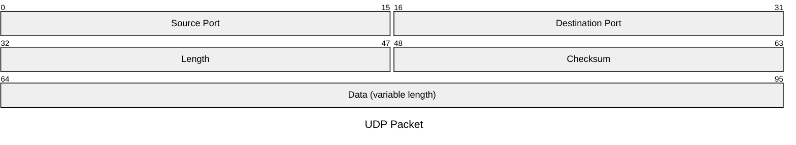

# Introduction

This article demonstrates how to model network communication using a `Packet Diagram` represented
as a `Mermaid Packet Diagram` and leverage a `Large Language Model (LLM)` to generate `Kotlin`
code based on the diagram. The generated code captures the structure and behavior of a
`UDP packet`, including fields such as `sourcePort`, `destinationPort`, `length`, `checksum`, and
`data`, while incorporating modern development practices like type safety and modular design.
Additionally, the article explores how `LLMs` can generate `JUnit 4` unit test code to validate
the functionality of the `UDPPacket` class, ensuring correct parsing, building, serialization, and
error handling.

# Packet Diagram

A `Packet Diagram` is a graphical representation used to illustrate the flow of `data packets`
across a network. It provides a clear depiction of how information is transmitted between different
components, such as clients, servers, routers, and other network devices. These diagrams are
valuable for understanding the structure and behavior of `communication protocols`, identifying
potential bottlenecks, and troubleshooting `network issues`. Packet diagrams are commonly used in
the fields of networking, software development, and system design to visualize interactions between
systems, analyze `data transmission paths`, and ensure efficient and secure communication. By
breaking down complex interactions into an easy-to-understand format, `packet diagrams` help teams
design, optimize, and maintain reliable network architectures.

## Mermaid Packet Diagram

`Mermaid packet diagrams` are a versatile tool for visualizing network communication in a way that
is both human-readable and easily editable. Written in a simple text-based syntax, they allow
developers and designers to create and modify diagrams without requiring specialized software,
making them highly accessible. These diagrams can be integrated and displayed in various
environments, including `Markdown` files, `wikis`, and documentation tools, ensuring broad
compatibility and ease of sharing. This flexibility makes `Mermaid` an excellent choice for
collaborative projects, enabling teams to document and communicate packet flows clearly and
efficiently while keeping the workflow lightweight and adaptable.

[Mermaid Packet Diagram Docs](https://mermaid.js.org/syntax/packet.html)

### The Raw Code of the Mermaid Packet Diagram

```
packet-beta
title UDP Packet
0-15: "Source Port"
16-31: "Destination Port"
32-47: "Length"
48-63: "Checksum"
64-95: "Data (variable length)"
```

### The Mermaid Packet Diagram Embedded and Displayed in Markdown



### Screenshot of the Mermaid Packet Diagram

A screenshot of the Mermaid Packet Diagram above is provided in case it cannot be displayed
properly in some browser:


> [!NOTE]
> This packet diagram is from https://mermaid.js.org/syntax/packet.html

# Convert the Packet Diagram into Kotlin Code

I explored using a Large Language Model (LLM) to convert a Mermaid Packet Diagram into Kotlin code
and found it to perform exceptionally well. The process was efficient, with the LLM accurately
interpreting the structure of the data packets, their fields, and the communication flow described
in the diagram. It generated Kotlin code capable of building and parsing UDP packets, including
defining core components like `sourcePort`, `destinationPort`, `length`, `checksum`, and `data`. The
code adhered to best practices by implementing methods to `build` packets from components, `parse`
packets from raw byte arrays, and serialize packets to `ByteArray` for transmission. Additionally,
it included a simple `checksum` calculation as a placeholder for validating packet integrity. The
resulting code was clean, aligned with the intent of the packet diagram, and practical for
real-world networking tasks, demonstrating how LLMs can effectively bridge the gap between
`network design` and `implementation` in software engineering.

## The Prompt I Used

```text
packet-beta
title UDP Packet
0-15: "Source Port"
16-31: "Destination Port"
32-47: "Length"
48-63: "Checksum"
64-95: "Data (variable length)"
---Generate a Kotlin class to build and parse this UDP packet.
```

I deliberately tested a very simple prompt to evaluate whether LLMs could accurately interpret the
information in a packet diagram, such as the `checksum` and `variable length` fields. ChatGPT-4
demonstrated a strong understanding of the diagram, accurately identifying the relationships and
logic required to handle these components. It successfully generated Kotlin code that incorporated
the `checksum` calculation and managed `variable length` data within the packet structure. This
outcome highlights the capability of LLMs like ChatGPT-4 to extract detailed information from visual
or descriptive inputs and translate them into functional, correct, and efficient code
implementations.

## Code Generated by ChatGPT 4o

```kotlin
class UDPPacket(
 val sourcePort: Int,
 val destinationPort: Int,
 val length: Int,
 val checksum: Int,
 val data: ByteArray
) {

 companion object {
  private const val HEADER_SIZE = 8

  /**
   * Parse a byte array into a UDPPacket instance.
   */
  fun parse(packet: ByteArray): UDPPacket {
   require(packet.size >= HEADER_SIZE) { "Invalid packet size, must be at least $HEADER_SIZE bytes." }

   val buffer = ByteBuffer.wrap(packet)

   val sourcePort = buffer.short.toInt() and 0xFFFF
   val destinationPort = buffer.short.toInt() and 0xFFFF
   val length = buffer.short.toInt() and 0xFFFF
   val checksum = buffer.short.toInt() and 0xFFFF

   val data = ByteArray(length - HEADER_SIZE)
   buffer.get(data)

   return UDPPacket(sourcePort, destinationPort, length, checksum, data)
  }

  /**
   * Build a UDPPacket instance from its components.
   */
  fun build(sourcePort: Int, destinationPort: Int, data: ByteArray): UDPPacket {
   val length = HEADER_SIZE + data.size
   val checksum = calculateChecksum(sourcePort, destinationPort, length, data)
   return UDPPacket(sourcePort, destinationPort, length, checksum, data)
  }

  /**
   * Calculate a simple checksum for the packet. This is a placeholder and should be replaced with the proper UDP checksum logic.
   */
  private fun calculateChecksum(
   sourcePort: Int,
   destinationPort: Int,
   length: Int,
   data: ByteArray
  ): Int {
   var checksum = sourcePort + destinationPort + length
   data.forEach { checksum += it.toInt() and 0xFF }
   return checksum and 0xFFFF
  }
 }

 /**
  * Convert the UDPPacket instance into a byte array for transmission.
  */
 fun toByteArray(): ByteArray {
  val buffer = ByteBuffer.allocate(length)
  buffer.putShort(sourcePort.toShort())
  buffer.putShort(destinationPort.toShort())
  buffer.putShort(length.toShort())
  buffer.putShort(checksum.toShort())
  buffer.put(data)
  return buffer.array()
 }

 override fun toString(): String {
  return "UDPPacket(sourcePort=$sourcePort, destinationPort=$destinationPort, length=$length, checksum=$checksum, data=${
   data.toString(
    Charset.defaultCharset()
   )
  })"
 }
}

fun main() {
 // Example usage

 val sourcePort = 12345
 val destinationPort = 80
 val data = "Hello, UDP!".toByteArray()

 // Build a UDP packet
 val packet = UDPPacket.build(sourcePort, destinationPort, data)
 println("Built Packet: $packet")

 // Convert to byte array
 val packetBytes = packet.toByteArray()
 println("Packet Bytes: ${packetBytes.joinToString { String.format("%02X", it) }}")

 // Parse the byte array back into a UDPPacket
 val parsedPacket = UDPPacket.parse(packetBytes)
 println("Parsed Packet: $parsedPacket")
}
```

The code generated from the Mermaid packet diagram accurately represents the structure and behavior
of a UDP packet as described in the diagram. It defines a `UDPPacket` class with fields
corresponding to the packet's components: `sourcePort`, `destinationPort`, `length`, `checksum`, and
`data`. The `parse` method correctly interprets a byte array into a `UDPPacket` instance by
extracting fields in the correct sequence and handling the variable-length data. Similarly, the
`build` method constructs a `UDPPacket` from its components, dynamically calculating the `length`
and `checksum`. The `toByteArray` method ensures proper serialization of the packet for
transmission, and the checksum calculation logic, though simple, provides a placeholder that aligns
with the diagram's description. The generated code adheres to best practices, including clear error
handling, modular design, and a clean implementation of core packet operations.

# Generating Unit Tests

We can also leverage LLMs to generate unit tests for the code they produce, ensuring the
functionality and reliability of the implementation. By providing specific instructions about the
functions to be tested, as well as the Android or Kotlin unit testing libraries permitted—such as
JUnit, Mockito, or Kotlin Coroutines Test—we can guide the model to create precise, contextually
relevant test cases.

## The Prompt I Used

```text
Generate JUnit 4 unit tests in Kotlin to test the public functions of the UDPPacket class.
```

## Code Generated by ChatGPT 4o

```kotlin
class UDPPacketTest {

 @Test
 fun `test parse valid packet`() {
  val sourcePort = 1234
  val destinationPort = 5678
  val data = "Hello, World!".toByteArray(Charset.defaultCharset())
  val length = 8 + data.size
  val checksum =
   sourcePort + destinationPort + length + data.sumOf { it.toInt() and 0xFF } and 0xFFFF

  val packetBytes = ByteBuffer.allocate(length).apply {
   putShort(sourcePort.toShort())
   putShort(destinationPort.toShort())
   putShort(length.toShort())
   putShort(checksum.toShort())
   put(data)
  }.array()

  val packet = UDPPacket.parse(packetBytes)

  assertEquals(sourcePort, packet.sourcePort)
  assertEquals(destinationPort, packet.destinationPort)
  assertEquals(length, packet.length)
  assertEquals(checksum, packet.checksum)
  assertArrayEquals(data, packet.data)
 }

 @Test(expected = IllegalArgumentException::class)
 fun `test parse invalid packet size`() {
  val invalidPacket = ByteArray(4) // Less than header size
  UDPPacket.parse(invalidPacket)
 }

 @Test
 fun `test build packet`() {
  val sourcePort = 1234
  val destinationPort = 5678
  val data = "Test Data".toByteArray(Charset.defaultCharset())

  val packet = UDPPacket.build(sourcePort, destinationPort, data)

  val expectedLength = 8 + data.size
  val expectedChecksum =
   sourcePort + destinationPort + expectedLength + data.sumOf { it.toInt() and 0xFF } and 0xFFFF

  assertEquals(sourcePort, packet.sourcePort)
  assertEquals(destinationPort, packet.destinationPort)
  assertEquals(expectedLength, packet.length)
  assertEquals(expectedChecksum, packet.checksum)
  assertArrayEquals(data, packet.data)
 }

 @Test
 fun `test toByteArray`() {
  val sourcePort = 4321
  val destinationPort = 8765
  val data = "UDP Test".toByteArray(Charset.defaultCharset())
  val packet = UDPPacket.build(sourcePort, destinationPort, data)

  val byteArray = packet.toByteArray()
  val parsedPacket = UDPPacket.parse(byteArray)

  assertEquals(packet.sourcePort, parsedPacket.sourcePort)
  assertEquals(packet.destinationPort, parsedPacket.destinationPort)
  assertEquals(packet.length, parsedPacket.length)
  assertEquals(packet.checksum, parsedPacket.checksum)
  assertArrayEquals(packet.data, parsedPacket.data)
 }

 @Test
 fun `test toString`() {
  val sourcePort = 1111
  val destinationPort = 2222
  val data = "String Test".toByteArray(Charset.defaultCharset())
  val packet = UDPPacket.build(sourcePort, destinationPort, data)

  val expectedString =
   "UDPPacket(sourcePort=$sourcePort, destinationPort=$destinationPort, length=${8 + data.size}, checksum=${packet.checksum}, data=${
    data.toString(Charset.defaultCharset())
   })"
  assertEquals(expectedString, packet.toString())
 }
}
```

The unit test code above tests the `UDPPacket` class's core functions, including parsing,
building, serialization, and string representation. It validates correct handling of valid UDP
packets by checking field values such as `sourcePort`, `destinationPort`, `length`, `checksum`, and
`data`. The tests include edge cases, such as parsing packets with invalid sizes, to ensure robust
error handling. The `toByteArray` method is tested for accurate serialization and deserialization by
comparing the original packet with the parsed packet. Additionally, the `toString` method is
verified for correct output formatting. By covering a wide range of scenarios, these tests provide
confidence in the correctness and stability of the `UDPPacket` class, showcasing the ability of LLMs
to support end-to-end development and testing workflows.

# Areas for Further Exploration

Areas for further exploration include leveraging `Large Language Models (LLMs)` to convert more
complex packet diagrams, such as those with nested layers and replaceable sections, into a
formalized class hierarchy using `generics` in Kotlin. These advanced diagrams could represent
intricate network protocols or customizable data structures, requiring the generation of classes
that encapsulate hierarchical relationships and interchangeable components.