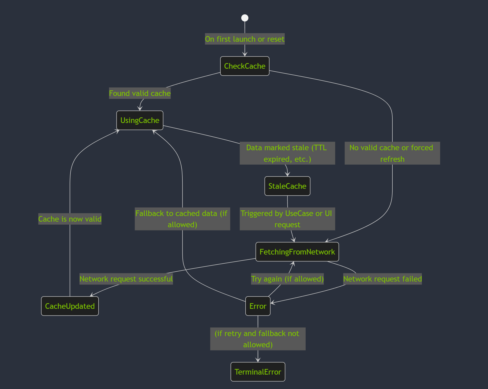

## Introduction

This repository showcases my explorations and findings on various topics, including Android app
development using AI, featuring experiments, techniques, and insights that I find useful and
intriguing.

---

## Google's `Now in Android` Demo App Project

The `Now in Android` project is an open-source Android application designed to demonstrate best
practices in modern Android development. I have been following this demo project closely and have
made some small contributions to its development.

*Image © Google*

[My Notes on Now in Android](docs/NowInAndroidApp.md)

---

## DJI's `Mobile-SDK-Android-V5` Demo App Project

DJI (the drone company)'s `Mobile-SDK-Android-V5` project serves as an excellent example of
utilizing the DJI Mobile SDK for advanced scientific and industrial applications, as well as for
building sophisticated user interfaces for Android apps.

*Image © DJI*

[My Notes on Mobile-SDK-Android-V5](docs/DjiDronesAndroidSdk.md)

---

## From Architectural Dependency Diagram to Code

[This document](docs/ArchitecturalDependencyDiagramToCode.md) explores the use of `Mermaid 
flowcharts` and `LLM` to design and implement Android app architectures. The
`Architectural Dependency Diagrams` visually represent the dependencies between an Android app's
architectural classes, serving as a foundation for generating Kotlin source code with `LLMs` while
promoting modularity, separation of concerns, and scalability.

---

## From State Diagram to Code

[This article](docs/StateDiagramToCode.md) demonstrates how to model complex logic with Mermaid
state diagrams and use LLMs to generate Kotlin code and unit tests based on the diagrams,
incorporating best practices such as coroutines, dependency injection, and error handling in Android
development.

---

## From Packet Diagram to Code

[This article](docs/PacketDiagramToCode.md) demonstrates how to model network communication with
Mermaid packet diagrams and use LLMs to generate Kotlin code and JUnit tests for UDP packet
structures, including checksum calculation.

---

## From Code to Entity Relationship Diagram, From Entity Relationship Diagram to Code

[This article ](docs/EntityRelationshipDiagramToCode.md) demonstrates how to model complex data
relationships by converting Kotlin code into Mermaid ER diagrams and generating Kotlin code from
Mermaid ER diagrams using LLMs, showcasing a bidirectional workflow between code and visual
documentation.

---

## From Code to Mindmap

[This article](docs/CodeToMindmap.md) explores how to use LLMs to generate Mermaid mindmaps from
source code, such as the complex `SyncWorker` in the Now in Android app, to visualize relationships,
dependencies, and features for improved understanding and documentation.

---

## Use Unit Tests to Consolidate Knowledge

[This article](docs/UseUnitTestsToConsolidateKnowledge.md) explores how writing unit tests can
deepen understanding of Kotlin features like null safety and experimental contracts, providing
practical examples, insights into edge cases, and safeguards for evolving language behaviors.

---

## Generate Python Code and Video Using ChatGPT

[This article](docs/GeneratePythonCodeAndProduceVideo.md) shares my experience using ChatGPT to
generate a 120fps video for testing an Android device's playback performance.