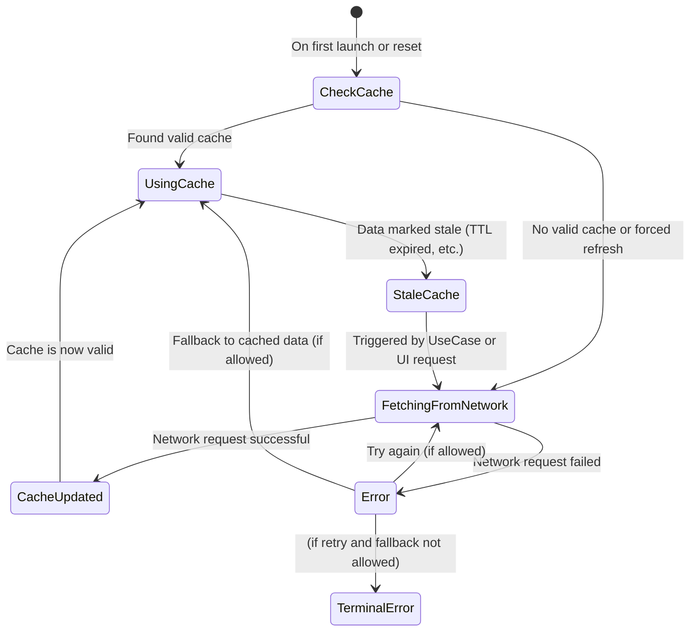

# State Diagram

A state diagram is particularly effective at modeling the dynamic behavior of a system by
representing its states, transitions, and events. It is ideal for visualizing how a system or
component responds to external inputs, progresses through different states, and enforces rules or
constraints on transitions. State diagrams are commonly used in software design for systems with
well-defined states, such as user interfaces, workflows, communication protocols, or event-driven
applications. They help clarify complex behaviors, identify edge cases, and ensure a shared
understanding among developers, making them invaluable for designing and validating systems with
state-dependent logic.

## Mermaid State Diagram

Mermaid state diagrams are a versatile tool for visualizing state-based behavior in a way that is
both human-readable and easily editable. Written in a simple text-based syntax, they allow
developers and designers to create and modify diagrams without requiring specialized software,
making them highly accessible. These diagrams can be integrated and displayed in various
environments, including Markdown files, wikis, and documentation tools, ensuring broad compatibility
and ease of sharing. This flexibility makes Mermaid an excellent choice for collaborative projects,
enabling teams to document and communicate state transitions clearly and efficiently while keeping
the workflow lightweight and adaptable.

I created this Mermaid state diagram to model a repository's behavior for demonstration purposes,
illustrating the flow of data handling and transitions between states. It captures key scenarios
such as checking for cached data, fetching updates from the network, handling errors, and updating
the cache. The diagram highlights how the repository reacts to events like cache expiration, network
failures, and user-triggered actions, making it a useful tool for visualizing the repository's logic
and ensuring that edge cases, like error fallback or retry mechanisms, are accounted for in the
design.

