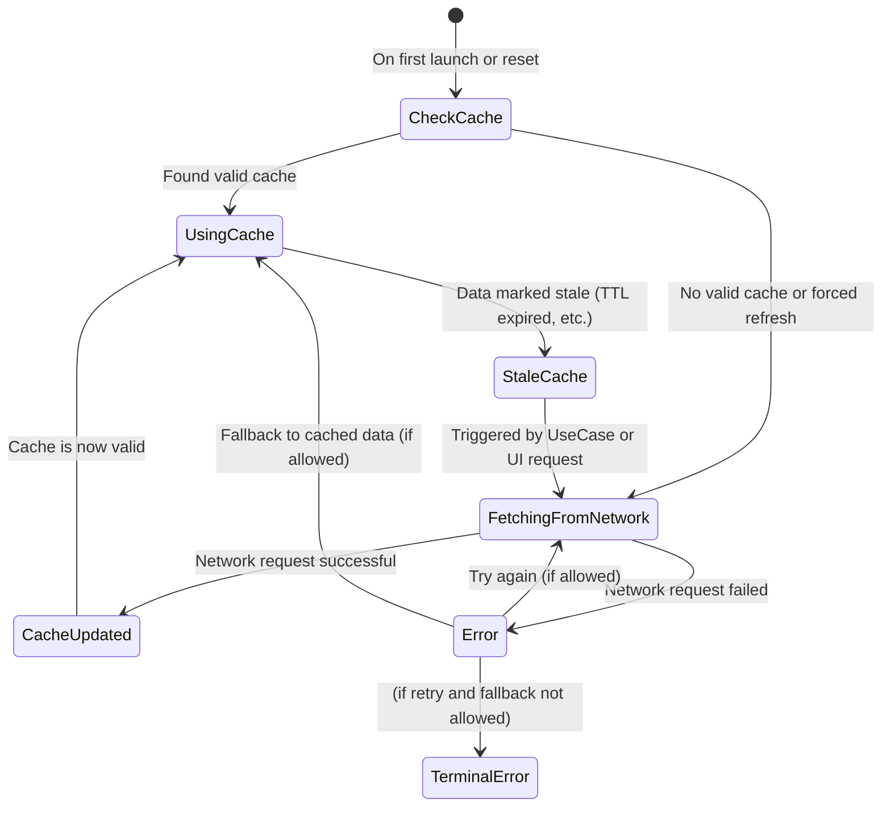
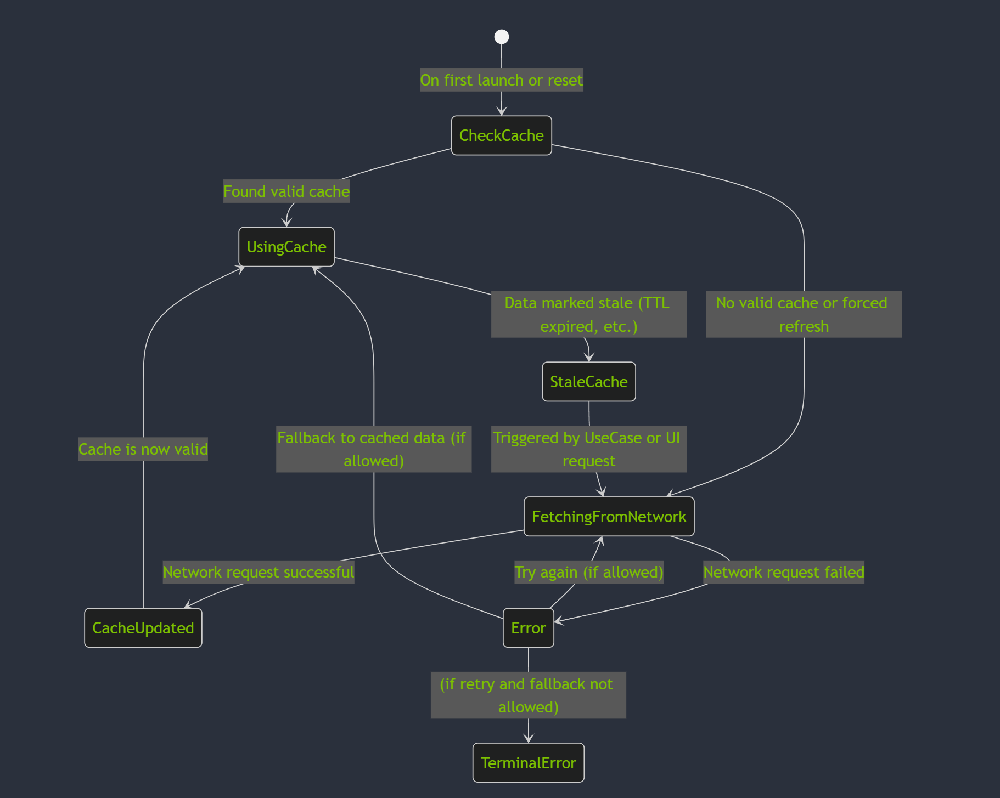

> [!NOTE]
> This article demonstrates how to model complex logic using a Mermaid state diagram and leverage a
> Large Language Model (LLM) to generate Android Kotlin code based on the diagram. The generated
> code incorporates modern development practices, including Kotlin Coroutines for asynchronous
> operations and Dependency Injection for managing dependencies effectively.
>
> Additionally, the article explores how LLMs can be used to generate unit test code to validate the
> functionality of the generated code.
>
> By providing clear instructions and refining prompts, developers can produce robust functional and
> test code, streamlining the workflow from design to implementation and testing. This approach
> highlights the power of LLMs in bridging design and development while ensuring high-quality,
> maintainable code.

# State Diagram

A state diagram is particularly effective at modeling the dynamic behavior of a system by
representing its states, transitions, and events. It is ideal for visualizing how a system or
component responds to external inputs, progresses through different states, and enforces rules or
constraints on transitions. State diagrams are commonly used in software design for systems with
well-defined states, such as user interfaces, workflows, communication protocols, or event-driven
applications. They help clarify complex behaviors, identify edge cases, and ensure a shared
understanding among developers, making them invaluable for designing and validating systems with
state-dependent logic.

## Mermaid State Diagram

Mermaid state diagrams are a versatile tool for visualizing state-based behavior in a way that is
both human-readable and easily editable. Written in a simple text-based syntax, they allow
developers and designers to create and modify diagrams without requiring specialized software,
making them highly accessible. These diagrams can be integrated and displayed in various
environments, including Markdown files, wikis, and documentation tools, ensuring broad compatibility
and ease of sharing. This flexibility makes Mermaid an excellent choice for collaborative projects,
enabling teams to document and communicate state transitions clearly and efficiently while keeping
the workflow lightweight and adaptable.

### The Raw Code of the Mermaid State Diagram

```
stateDiagram-v2
    [*] --> CheckCache: On first launch or reset
    CheckCache --> UsingCache: Found valid cache
    CheckCache --> FetchingFromNetwork: No valid cache or forced refresh
    UsingCache --> StaleCache: Data marked stale (TTL expired, etc.)
    StaleCache --> FetchingFromNetwork: Triggered by UseCase or UI request
    FetchingFromNetwork --> CacheUpdated: Network request successful
    FetchingFromNetwork --> Error: Network request failed
    CacheUpdated --> UsingCache: Cache is now valid
    Error --> FetchingFromNetwork: Try again (if allowed)
    Error --> UsingCache: Fallback to cached data (if allowed)
    Error --> TerminalError: (if retry and fallback not allowed)
```

### The Mermaid State Diagram Embedded and Displayed in Markdown



### Screenshot of the Mermaid State Diagram

A screenshot of the Mermaid State Diagram above is provided in case it cannot be displayed
properly in some browser:



I created this Mermaid state diagram to model a repository's behavior for demonstration purposes,
illustrating the flow of data handling and transitions between states. It captures key scenarios
such as checking for cached data, fetching updates from the network, handling errors, and updating
the cache. The diagram highlights how the repository reacts to events like cache expiration, network
failures, and user-triggered actions, making it a useful tool for visualizing the repository's logic
and ensuring that edge cases, like error fallback or retry mechanisms, are accounted for in the
design.

# Convert the State Diagram into Kotlin Code

I explored using a Large Language Model (LLM) to convert a Mermaid State Diagram into Kotlin code
and found it to perform remarkably well. The process was efficient, with the LLM accurately
interpreting the states, transitions, and overall logic represented in the diagram. It was able to
generate Kotlin code that adhered to best practices, including the use of coroutines, dependency
injection, and proper error handling. The resulting code was both clean and aligned with the
original intent of the state diagram, demonstrating how LLMs can effectively bridge the gap between
design visualization and implementation in software development.

## The Prompt I Used

> Convert this state diagram into a `DataRepository` class in Kotlin. Inject the dependencies
> `DataCache`, `NetworkDataSource`, and `CoroutineDispatcher` using Dagger/Hilt. Use Kotlin
> Coroutines `suspend` functions for I/O operations. Define a `canRetry(retriedTimes)` function in
> `NetworkDataSource` and a `canFallback()` function in `DataCache`. Return a `Flow<Result<Data>>`,
> without including a loading state in the `Result`. Only return `Success` when the data is not
> stale.

## Code Generated by ChatGPT o1

```kotlin
/**
 * Simple Result class with only Success and Error states.
 */
sealed class Result<out T> {
 data class Success<out T>(val data: T) : Result<T>()
 data class Error(val throwable: Throwable) : Result<Nothing>()
}

/**
 * A simple data model.
 */
data class Data(val value: String, val timestampMillis: Long)

/**
 * DataCache is responsible for storing/fetching data locally
 * and determining if the cached data is stale. Also provides canFallback().
 */
interface DataCache {
 suspend fun getData(): Data?
 suspend fun saveData(data: Data)
 fun isStale(data: Data): Boolean
 fun canFallback(): Boolean
}

/**
 * NetworkDataSource is responsible for fetching data from the network
 * and determining if a retry is allowed.
 */
interface NetworkDataSource {
 suspend fun fetchData(): Data
 fun canRetry(retryCount: Int): Boolean
}

/**
 * Example dispatcher qualifier if you are using Hilt's @Qualifiers
 */
// @Qualifier
// @Retention(AnnotationRetention.BINARY)
// annotation class IoDispatcher

@Singleton
class DataRepository @Inject constructor(
 private val dataCache: DataCache,
 private val networkDataSource: NetworkDataSource,
 // If using Hilt's qualifiers, something like:
 // @IoDispatcher 
 private val ioDispatcher: CoroutineDispatcher
) {

 /**
  * The main entry point that returns a Flow of Result<Data>.
  * @param forceRefresh If true, bypass valid cache and fetch from network.
  */
 fun getData(forceRefresh: Boolean = false): Flow<Result<Data>> = flow {
  // Step 1: Check the cache
  val cachedData = dataCache.getData()

  // Decide if cache is valid (non-null and not stale)
  val isCacheValid = (cachedData != null && !dataCache.isStale(cachedData))

  if (!forceRefresh && isCacheValid) {
   // CheckCache --> UsingCache
   // Return Success because the cache is valid and not stale
   emit(Result.Success(cachedData!!))
  } else {
   // Either forced refresh or no valid cache -> proceed to network fetch
   val result = fetchFromNetworkWithFallback(cachedData)
   emit(result)
  }
 }.flowOn(ioDispatcher)

 /**
  * Fetches data from the network, handles retries, and falls back to cache if allowed.
  */
 private suspend fun fetchFromNetworkWithFallback(cachedData: Data?): Result<Data> {
  var retryCount = 0

  while (true) {
   // FetchingFromNetwork
   try {
    val newData = networkDataSource.fetchData()
    // CacheUpdated
    dataCache.saveData(newData)
    // UsingCache -> return Success with fresh data
    return Result.Success(newData)
   } catch (e: Exception) {
    // Error
    if (networkDataSource.canRetry(retryCount)) {
     // Error --> FetchingFromNetwork (try again)
     retryCount++
     continue
    } else if (dataCache.canFallback()) {
     // Error --> UsingCache (fallback to cached data) *if it is not stale*
     if (cachedData != null && !dataCache.isStale(cachedData)) {
      return Result.Success(cachedData)
     } else {
      // Even fallback is stale or null => no valid fallback
      return Result.Error(
       IllegalStateException("No valid fallback data available.")
      )
     }
    } else {
     // TerminalError => no retry, no fallback
     return Result.Error(e)
    }
   }
  }
 }
}
```

ChatGPT's o1 model demonstrates notable strength in performing complex tasks when compared to other
models like GPT-4o. The o1 model excels in understanding nuanced prompts, managing intricate
workflows, and generating coherent, contextually accurate responses. Its optimization for
task-oriented scenarios allows it to handle challenges requiring deep reasoning or technical
accuracy with higher consistency and speed. While GPT-4o is robust in general conversational
abilities, the o1 model is specifically designed to shine in domains where precision and structure
are critical, such as coding, advanced problem-solving, or detailed analysis. This tailored focus
makes the O1 model a powerful tool for users tackling multifaceted projects.

The prompt and code generated above do not specify the use of any particular state modeling
architecture, such as representing states with enums or interfaces/classes to formalize state
handling. This approach provides flexibility but may lack the structure offered by formal state
representations. I also refined the prompt to include explicit requirements for using enums or
sealed interfaces/classes to model states. The o1 model successfully understood and followed these
additional instructions, generating code that adhered to the specified architectural guidelines. I
will demonstrate these more advanced state modeling techniques in a separate article.

# Generating Unit Tests

We can also leverage LLMs to generate unit tests for the code they produce, streamlining the testing
process. By providing specific instructions about the functions to be tested, as well as the Android
or Kotlin unit testing libraries permitted—such as JUnit, Mockito, or Kotlin Coroutines Test—we can
guide the model to create precise, contextually relevant test cases. The LLM can handle various
scenarios, including edge cases, success paths, and error conditions, ensuring robust test coverage.

## The Prompt I Used

> Generate unit tests in Kotlin to test the `fun getData(forceRefresh: Boolean = false)` function.
> Create stub implementations of `DataCache` and `NetworkDataSource` to facilitate testing. Do
> not use any mocking library, such as Mockito.

## Code Generated by ChatGPT 4o

```kotlin
class DataRepositoryTest {

 private lateinit var dataCache: StubDataCache
 private lateinit var networkDataSource: StubNetworkDataSource
 private lateinit var repository: DataRepository

 private val testDispatcher = StandardTestDispatcher()

 // Stub implementations

 private class StubDataCache : DataCache {
  var cachedData: Data? = null
  var stale: Boolean = false
  override suspend fun getData(): Data? = cachedData

  override suspend fun saveData(data: Data) {
   cachedData = data
  }

  override fun isStale(data: Data): Boolean = stale

  override fun canFallback(): Boolean = cachedData != null
 }

 private class StubNetworkDataSource : NetworkDataSource {
  var dataToReturn: Data? = null
  var shouldThrowError: Boolean = false

  override suspend fun fetchData(): Data {
   if (shouldThrowError) throw Exception("Network Error")
   return dataToReturn ?: throw Exception("No Data")
  }

  override fun canRetry(retryCount: Int): Boolean = retryCount < 3
 }

 @Before
 fun setUp() {
  dataCache = StubDataCache()
  networkDataSource = StubNetworkDataSource()
  repository = DataRepository(dataCache, networkDataSource, testDispatcher)
 }

 @Test
 fun `getData returns cached data when cache is valid`() = runTest(testDispatcher) {
  // Arrange
  val cachedData = Data("CachedValue", System.currentTimeMillis())
  dataCache.cachedData = cachedData

  // Act
  val results = repository.getData(forceRefresh = false).toList()

  // Assert
  assertEquals(1, results.size)
  assertEquals(Result.Success(cachedData), results[0])
 }

 @Test
 fun `getData fetches from network when cache is stale`() = runTest(testDispatcher) {
  // Arrange
  val cachedData = Data("StaleValue", System.currentTimeMillis() - 10000)
  val freshData = Data("FreshValue", System.currentTimeMillis())
  dataCache.cachedData = cachedData
  dataCache.stale = true
  networkDataSource.dataToReturn = freshData

  // Act
  val results = repository.getData(forceRefresh = false).toList()

  // Assert
  assertEquals(1, results.size)
  assertEquals(Result.Success(freshData), results[0])
  assertEquals(freshData, dataCache.cachedData)
 }

 @Test
 fun `getData fetches from network when forceRefresh is true`() = runTest(testDispatcher) {
  // Arrange
  val cachedData = Data("CachedValue", System.currentTimeMillis())
  val freshData = Data("FreshValue", System.currentTimeMillis())
  dataCache.cachedData = cachedData
  networkDataSource.dataToReturn = freshData

  // Act
  val results = repository.getData(forceRefresh = true).toList()

  // Assert
  assertEquals(1, results.size)
  assertEquals(Result.Success(freshData), results[0])
  assertEquals(freshData, dataCache.cachedData)
 }

 @Test
 fun `getData falls back to cache when network fails and cache is valid`() =
  runTest(testDispatcher) {
   // Arrange
   val cachedData = Data("CachedValue", System.currentTimeMillis())
   dataCache.cachedData = cachedData
   networkDataSource.shouldThrowError = true

   // Act
   val results = repository.getData(forceRefresh = false).toList()

   // Assert
   assertEquals(1, results.size)
   assertEquals(Result.Success(cachedData), results[0])
  }

 @Test
 fun `getData returns error when network fails and no valid cache`() = runTest(testDispatcher) {
  // Arrange
  dataCache.cachedData = null
  networkDataSource.shouldThrowError = true

  // Act
  val results = repository.getData(forceRefresh = false).toList()

  // Assert
  assertEquals(1, results.size)
  assert(results[0] is Result.Error)
 }
}
```

> [!NOTE]
> GPT 4o is sufficient for performing this task.

# Areas to Explore

Use LLM to convert more complex state diagrams (with hierarchies, such as the
[StateCharts](https://www.state-machine.com/doc/Harel87.pdf)) into a more formalized state machine
in Kotlin.

