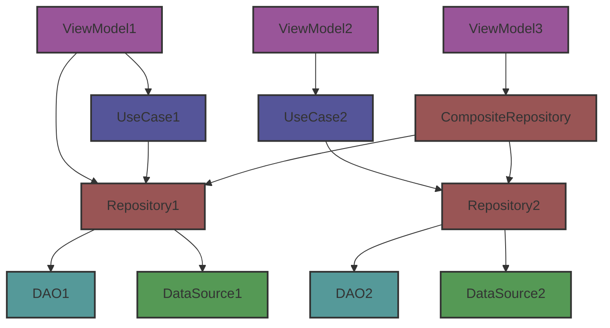

# Introduction

This document explores the use of `Mermaid flowcharts` and `LLM` to design and implement Android app
architectures. The `Architectural Dependency Diagrams` visually represent the dependencies between
an Android app's architectural classes, serving as a foundation for generating Kotlin source code
with `LLMs` while promoting modularity, separation of concerns, and scalability.

# Architectural Dependency Diagram

A `dependency diagram` is a tool used in architecture design to visually represent the relationships
and dependencies between different layers or components of a system. It helps identify and enforce
architectural constraints by showing how elements such as classes, namespaces, or modules interact
with one another. This type of diagram is useful for ensuring that dependencies align with the
intended design, minimizing unwanted couplings, and promoting a clear separation of concerns. By
providing an overview of system dependencies, it aids in maintaining consistency, reducing
complexity, and supporting scalability during development.

Read more:
[Microsoft: Dependency diagrams: guidelines](https://learn.microsoft.com/en-us/visualstudio/modeling/layer-diagrams-guidelines?view=vs-2022)

## Draw Architectural Dependency Diagrams with Mermaid Flowchart

`Mermaid` does not provide a dedicated syntax for creating dependency diagrams, but its `Flowchart`
diagram is highly versatile and can effectively represent dependency relationships. In this article,
I used a straightforward convention: if node `A` points to node `B`, it indicates that `A` depends
on `B`. In the context of dependency injection, this means that `B` should be injected into `A`,
which is the opposite direction of the arrow. To enhance clarity, I used different colors to
represent classes at various architectural hierarchy levels: `ViewModel`, `Usecase`, `Repository`,
`DAO`, and `DataSource`.

# Generate a Sample Architectural Dependency Diagram

For demonstration purposes, I asked an `LLM` to generate an Android app architectural dependency
diagram featuring the key components: `ViewModel`, `Usecase`, `Repository`, `DAO`, and `DataSource`.
This diagram illustrates the dependencies between these layers, showcasing how data flows through
the architecture and highlighting the separation of concerns. By using these distinct layers, the
architecture promotes modularity, maintainability, and scalability, making it easier to manage and
extend the app's functionality over time.

Read more:
[Google: Architecture Learning Journey](https://github.com/android/nowinandroid/blob/main/docs/ArchitectureLearningJourney.md)

## The Prompt I Used

```text
Generate a Mermaid flowchart to show the dependency relationships of 10 classes in a demo Android
app. The top level consists of ViewModels, which depend on UseCases. These UseCases depend on
Repositories, which in turn depend on DAOs and DataSources. Additionally, there are composite
Repositories that depend on other Repositories. Some ViewModels also directly depend on
Repositories.
```

## The Raw Code of the Dependency Diagram Generated by ChatGPT 4o

```text
flowchart TD
%% Define Classes
    classDef viewModel fill: #959, stroke: #333, stroke-width: 2px;
    classDef useCase fill: #559, stroke: #333, stroke-width: 2px;
    classDef repository fill: #955, stroke: #333, stroke-width: 2px;
    classDef dao fill: #599, stroke: #333, stroke-width: 2px;
    classDef dataSource fill: #595, stroke: #333, stroke-width: 2px;

%% ViewModels
    VM1[ViewModel1]:::viewModel
    VM2[ViewModel2]:::viewModel
    VM3[ViewModel3]:::viewModel
%% UseCases
    UC1[UseCase1]:::useCase
    UC2[UseCase2]:::useCase
%% Repositories
    Repo1[Repository1]:::repository
    Repo2[Repository2]:::repository
    Repo3[CompositeRepository]:::repository
%% DAOs
    DAO1[DAO1]:::dao
    DAO2[DAO2]:::dao
%% DataSources
    DS1[DataSource1]:::dataSource
    DS2[DataSource2]:::dataSource
%% Dependencies
    VM1 --> UC1
    VM1 --> Repo1
    VM2 --> UC2
    VM3 --> Repo3
    UC1 --> Repo1
    UC2 --> Repo2
    Repo1 --> DAO1
    Repo1 --> DS1
    Repo2 --> DAO2
    Repo2 --> DS2
    Repo3 --> Repo1
    Repo3 --> Repo2
```

## The Dependency Diagram Generated by ChatGPT 4o



## Screenshot of the Dependency Diagram

A screenshot of the Dependency Diagram above is provided in case it cannot be
displayed properly in some browser:


## How to Read the Dependency Diagram

In the diagram, if a node points to another node, it indicates a dependency relationship where the
source node depends on the target node. For example, `ViewModel1` depends on `UseCase1` and
`Repository1`, as indicated by the arrows pointing from `ViewModel1` to these nodes. In the context
of dependency injection, this relationship implies that `UseCase1` and `Repository1` should be
injected into `ViewModel1`. Similarly, `Repository1` depends on `DAO1` and `DataSource1`, which
means `DAO1` and `DataSource1` should be injected into `Repository1`. The direction of injection is
the reverse of the arrow, emphasizing that the dependent components (e.g., `ViewModel1` or
`Repository1`) receive the necessary dependencies (e.g., `UseCase1`, `DAO1`) to function.

In the diagram, different node colors are used to represent various layers within the architectural
hierarchy, making it easier to distinguish their roles and responsibilities. The five layers are:
`ViewModel` for managing UI-related data, `Usecase` for handling business logic, `Repository` for
bridging business logic and data sources, `DAO` for database interactions, and `DataSource` for
providing raw data from external sources such as APIs.

# Generate Android Kotlin Code from the Dependency Diagram

Now that we have the dependency diagram, we can use it as a reference to guide an LLM in generating
Android app source code. Crafting effective prompts for this task requires attention to detail, as
the dependency diagram provides a high-level architectural view but lacks specifics related to
Android app programming. The prompts need to clearly specify the requirements, including Android
framework components, design patterns, and implementation details, to align with the dependencies
shown in the diagram. After several iterations and refinements, I found the prompt below to be good
enough to generate meaningful and functional code for the desired architecture.

## The Prompt I Used

```text
Generate Kotlin code for an architecture example with three layers: DAO, DataSource, and
Repository.

Each layer should have three implementations: Prod, Demo, and Test. Use Kotlin's Flow for
asynchronous data streams.

Apply dependency injection using Hilt with a @Qualifier annotation to distinguish between the Prod,
Demo, and Test implementations. Each implementation should provide mock data for simplicity.

Create a Hilt module that provides instances for each implementation of DAO, DataSource, and
Repository, with singleton scope.

Structure the code as follows:

- Define qualifiers @ProdImplementation, @DemoImplementation, and @TestImplementation.
- Define interfaces for DAO1, DataSource1, and Repository1.
- Implement three versions (Prod, Demo, and Test) for each interface.
- Write a Hilt module to provide the dependencies using the correct qualifiers.

The code should be well-organized, with proper annotations and comments explaining each section.
```

## Code and Explanation Generated by ChatGPT o1

Below is an example of a three-layer architecture (DAO → DataSource → Repository) in Kotlin using
Flow for asynchronous data streams and Hilt for dependency injection. Each layer has three
implementations: Prod, Demo, and Test. We’ll use @Qualifier annotations to distinguish between these
implementations and provide them in a Hilt module with singleton scope.

### Qualifiers

Create three qualifiers to distinguish between the Prod, Demo, and Test implementations.

```kotlin
package com.example.app.di.qualifiers

import javax.inject.Qualifier

@Qualifier
@Retention(AnnotationRetention.BINARY)
annotation class ProdImplementation

@Qualifier
@Retention(AnnotationRetention.BINARY)
annotation class DemoImplementation

@Qualifier
@Retention(AnnotationRetention.BINARY)
annotation class TestImplementation
```

- @Retention(AnnotationRetention.BINARY) ensures the qualifier is available at runtime for Hilt.
- @Qualifier is used by Hilt to differentiate among multiple bindings of the same type.

### DAO Layer

#### DAO1 Interface

```kotlin
package com.example.app.data.dao

import kotlinx.coroutines.flow.Flow

interface DAO1 {
 fun getData(): Flow<List<String>>
}
```

- The DAO (Data Access Object) layer is responsible for interacting with the local data store (e.g.,
  database).
- For simplicity, getData() returns a Flow of List<String>.

#### ProdDAO1

```kotlin
package com.example.app.data.dao

import kotlinx.coroutines.flow.Flow
import kotlinx.coroutines.flow.flowOf
import javax.inject.Inject

class ProdDAO1 @Inject constructor() : DAO1 {
 override fun getData(): Flow<List<String>> {
// In a real scenario, this would fetch data from a production database.
  return flowOf(listOf("Prod DAO Data 1", "Prod DAO Data 2"))
 }
}
```

#### DemoDAO1

```kotlin
package com.example.app.data.dao

import kotlinx.coroutines.flow.Flow
import kotlinx.coroutines.flow.flowOf
import javax.inject.Inject

class DemoDAO1 @Inject constructor() : DAO1 {
 override fun getData(): Flow<List<String>> {
// Returns mock data for demo builds.
  return flowOf(listOf("Demo DAO Data A", "Demo DAO Data B"))
 }
}
```

#### TestDAO1

```kotlin
package com.example.app.data.dao

import kotlinx.coroutines.flow.Flow
import kotlinx.coroutines.flow.flowOf
import javax.inject.Inject

class TestDAO1 @Inject constructor() : DAO1 {
 override fun getData(): Flow<List<String>> {
// Returns mock data for testing.
  return flowOf(listOf("Test DAO Data X", "Test DAO Data Y"))
 }
}
```

### DataSource Layer

#### DataSource1 Interface

```kotlin
package com.example.app.data.datasource

import kotlinx.coroutines.flow.Flow

interface DataSource1 {
 fun fetchData(): Flow<List<String>>
}
```

- The DataSource layer orchestrates data from the DAO and possibly other sources (like remote APIs).
- Here, fetchData() returns a Flow of List<String>.

#### ProdDataSource1

```kotlin
package com.example.app.data.datasource

import com.example.app.data.dao.DAO1
import kotlinx.coroutines.flow.Flow
import javax.inject.Inject

class ProdDataSource1 @Inject constructor(
 private val dao: DAO1
) : DataSource1 {
 override fun fetchData(): Flow<List<String>> {
// In a real scenario, might combine data from local DB + remote API
  return dao.getData()
 }
}
```

#### DemoDataSource1

```kotlin
package com.example.app.data.datasource

import com.example.app.data.dao.DAO1
import kotlinx.coroutines.flow.Flow
import javax.inject.Inject
import kotlinx.coroutines.flow.flow

class DemoDataSource1 @Inject constructor(
 private val dao: DAO1
) : DataSource1 {
 override fun fetchData(): Flow<List<String>> {
// Might simulate partial local + partial mock remote
  return flow {
   emit(listOf("Demo DataSource Start"))
   dao.getData().collect { daoData ->
    emit(daoData + "Demo Extra DataSource Info")
   }
  }
 }
}
```

#### TestDataSource1

```kotlin
package com.example.app.data.datasource

import com.example.app.data.dao.DAO1
import kotlinx.coroutines.flow.Flow
import javax.inject.Inject
import kotlinx.coroutines.flow.flow

class TestDataSource1 @Inject constructor(
 private val dao: DAO1
) : DataSource1 {
 override fun fetchData(): Flow<List<String>> {
// Entirely mock data flow for tests
  return flow {
   emit(listOf("Test DataSource Begin"))
   dao.getData().collect { daoData ->
    emit(daoData + "Test Additional Info")
   }
  }
 }
}
```

### Repository Layer

#### Repository1 Interface

```kotlin
package com.example.app.domain.repository

import kotlinx.coroutines.flow.Flow

interface Repository1 {
 fun loadItems(): Flow<List<String>>
}
The Repository layer provides a clean API to the rest of the app(
 e.g.,
 ViewModels,
 UseCases
).It depends on the DataSource layer to retrieve data, handle business logic, etc.
ProdRepository1
kotlin
Copy
package com.example.app.domain.repository

import com . example . app . data . datasource . DataSource1
 import kotlinx . coroutines . flow . Flow
 import javax . inject . Inject

class ProdRepository1 @Inject constructor(
 private val dataSource: DataSource1
) : Repository1 {
 override fun loadItems(): Flow<List<String>> {
// The real production repository might handle complex business logic
  return dataSource.fetchData()
 }
}
```

#### DemoRepository1

```kotlin
package com.example.app.domain.repository

import com.example.app.data.datasource.DataSource1
import kotlinx.coroutines.flow.Flow
import kotlinx.coroutines.flow.flow
import javax.inject.Inject

class DemoRepository1 @Inject constructor(
 private val dataSource: DataSource1
) : Repository1 {
 override fun loadItems(): Flow<List<String>> {
// Add additional logic for demonstration mode
  return flow {
   emit(listOf("Demo Repository Start"))
   dataSource.fetchData().collect { data ->
    emit(data + "Demo Repo Extra")
   }
  }
 }
}
```

#### TestRepository1

```kotlin
package com.example.app.domain.repository

import com.example.app.data.datasource.DataSource1
import kotlinx.coroutines.flow.Flow
import kotlinx.coroutines.flow.flow
import javax.inject.Inject

class TestRepository1 @Inject constructor(
 private val dataSource: DataSource1
) : Repository1 {
 override fun loadItems(): Flow<List<String>> {
// Provide purely mock data or specialized test transformations
  return flow {
   emit(listOf("Test Repository Start"))
   dataSource.fetchData().collect { data ->
    emit(data + "Test Repo Addon")
   }
  }
 }
}
```

### Hilt Module

Create a Hilt module to provide dependencies for each layer. The qualifiers ensure that Hilt knows
which implementation to use in each scenario. Below is one possible approach:

```kotlin
package com.example.app.di

import com.example.app.data.dao.*
import com.example.app.data.datasource.*
import com.example.app.di.qualifiers.DemoImplementation
import com.example.app.di.qualifiers.ProdImplementation
import com.example.app.di.qualifiers.TestImplementation
import com.example.app.domain.repository.*
import dagger.Module
import dagger.Provides
import dagger.hilt.InstallIn
import dagger.hilt.components.SingletonComponent
import javax.inject.Singleton

@Module
@InstallIn(SingletonComponent::class)
object AppModule {

 // --- DAO Provides ---
 @Provides
 @Singleton
 @ProdImplementation
 fun provideProdDAO1(): DAO1 = ProdDAO1()

 @Provides
 @Singleton
 @DemoImplementation
 fun provideDemoDAO1(): DAO1 = DemoDAO1()

 @Provides
 @Singleton
 @TestImplementation
 fun provideTestDAO1(): DAO1 = TestDAO1()

 // --- DataSource Provides ---
 @Provides
 @Singleton
 @ProdImplementation
 fun provideProdDataSource1(
  @ProdImplementation dao: DAO1
 ): DataSource1 = ProdDataSource1(dao)

 @Provides
 @Singleton
 @DemoImplementation
 fun provideDemoDataSource1(
  @DemoImplementation dao: DAO1
 ): DataSource1 = DemoDataSource1(dao)

 @Provides
 @Singleton
 @TestImplementation
 fun provideTestDataSource1(
  @TestImplementation dao: DAO1
 ): DataSource1 = TestDataSource1(dao)

 // --- Repository Provides ---
 @Provides
 @Singleton
 @ProdImplementation
 fun provideProdRepository1(
  @ProdImplementation dataSource: DataSource1
 ): Repository1 = ProdRepository1(dataSource)

 @Provides
 @Singleton
 @DemoImplementation
 fun provideDemoRepository1(
  @DemoImplementation dataSource: DataSource1
 ): Repository1 = DemoRepository1(dataSource)

 @Provides
 @Singleton
 @TestImplementation
 fun provideTestRepository1(
  @TestImplementation dataSource: DataSource1
 ): Repository1 = TestRepository1(dataSource)

}
```

#### How to Inject a Specific Implementation

Elsewhere in the app (e.g., in a ViewModel), you can choose the required implementation by using the
corresponding qualifier:

```kotlin
package com.example.app.ui

import androidx.lifecycle.ViewModel
import com.example.app.di.qualifiers.ProdImplementation
import com.example.app.domain.repository.Repository1
import dagger.hilt.android.lifecycle.HiltViewModel
import javax.inject.Inject

@HiltViewModel
class MyViewModel @Inject constructor(
 @ProdImplementation private val repository: Repository1
) : ViewModel() {
 // You can now call repository.loadItems() and collect the Flow
}
```

If you want to use a Demo or Test implementation, just replace @ProdImplementation with
@DemoImplementation or @TestImplementation.

### Summary

- Qualifiers (@ProdImplementation, @DemoImplementation, @TestImplementation) help Hilt distinguish
  between multiple bindings of the same type.
- DAO layer (DAO1) provides local data access (with ProdDAO1, DemoDAO1, TestDAO1).
- DataSource layer (DataSource1) orchestrates data from DAO and possibly remote sources (with
  ProdDataSource1, DemoDataSource1, TestDataSource1).
- Repository layer (Repository1) provides a clean interface for consuming UI (with ProdRepository1,
  DemoRepository1, TestRepository1).
- Hilt Module (AppModule) binds all implementations in a single place, using qualifiers to
  differentiate among them.
- Inject the desired implementation by referencing the appropriate qualifier in your consuming
  class (such as a ViewModel).

This setup allows you to switch between Prod, Demo, and Test implementations at compile time,
making it straightforward to test, demo, or release your application with minimal configuration
changes.

# Areas for Further Exploration

Creating a suite of reusable and modularized LLM prompts tailored for Android app programming.
These prompts would provide a flexible and efficient way to generate code for various architectural
designs, making it easier to adapt to different project requirements while maintaining clarity and
consistency in development workflows.