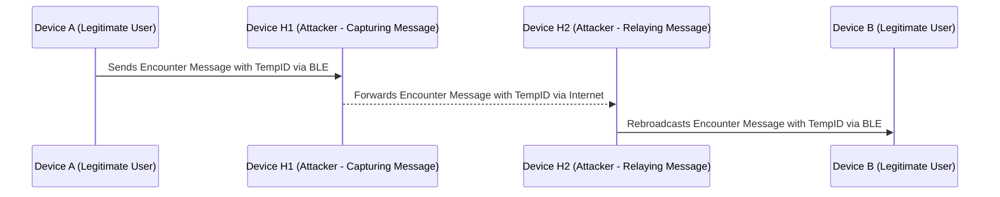
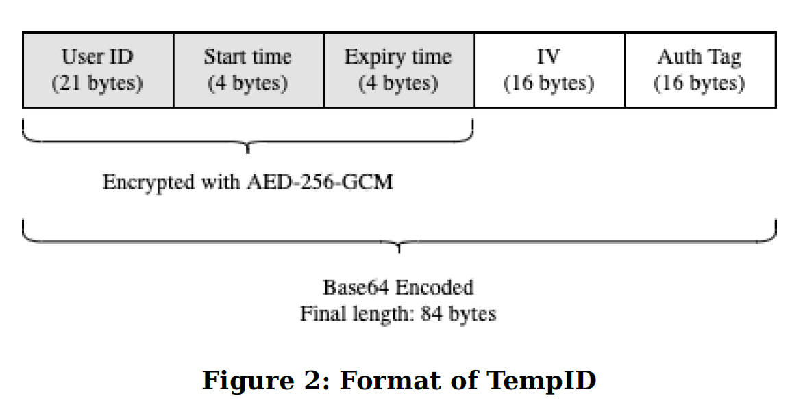

## Using TempIDs to Mitigate Replay Attacks and Prevent Third Parties from Tracking Users

Bluetooth-based contact tracing systems, such as BlueTrace, use TempIDs to enhance privacy and
security. TempIDs play a crucial role in mitigating replay attacks by frequently changing,
making it difficult for attackers to reuse captured messages. However, they do not prevent relay
attacks, where messages are forwarded in real-time to different locations. Additionally, TempIDs
help protect user privacy by preventing third parties from tracking individuals across multiple
locations. To further enhance efficiency, BlueTrace employs AES-256-GCM encryption to generate
TempIDs containing the static User ID, ensuring that the backend does not need to store all
generated TempIDs while still being able to link them to the static User IDs.

### Mitigating Replay Attacks

A replay/relay attack is a type of cyberattack where an attacker intercepts and then retransmits
or relays valid data to deceive a system into accepting it as legitimate. In the context of
Bluetooth-based protocols like BlueTrace, this attack can be exploited to create false
records of proximity between devices, potentially undermining the integrity of a contact tracing
system.

In a replay attack, an attacker captures the Bluetooth signal from one device and retransmits it
later, making it appear as if the original device was present at a different time/location. In a
relay attack, an attacker captures the Bluetooth signal from one device and forwards it in
real-time to another location using another device. These attacks could result in false positives,
leading to unnecessary quarantine or contact tracing efforts.

To mitigate these threats, BlueTrace implements short-lived TempIDs (recommended to expire
every 15 minutes), ensuring that replayed messages become invalid quickly.

### Relay Attacks: A Persistent Challenge

However, relay attacks remain a challenge since they occur in real-time and could still be used to
deceive the system by faking proximity records.

The sequence diagram above illustrates a relay attack on a Bluetooth-based contact tracing
system like BlueTrace. In this attack, `Device H1` and `Device H2` are at different locations.
`Device A`, a legitimate user, broadcasts an Encounter Message over BLE.
`Device H1`, an attacker, captures this message and transmits it over the Internet to
`Device H2`, which is located elsewhere. `Device H2` then rebroadcasts the same
Encounter Message over BLE, making it appear as though `Device A` is present at this
new location. Additionally, there could be multiple `H2 devices` carried by different attackers in
various locations, further amplifying the impact of the relay attack. As a result,
`Device B`, a legitimate user, mistakenly logs contact with `Device A`, even though they were never
physically close.

Note that replay and relay attackers do not need to be registered as users of apps implementing the
BlueTrace protocol because they only need to capture and retransmit BLE messages. BlueTrace
encounter messages are broadcast over BLE, meaning any device with Bluetooth sniffing capabilities
can passively capture these messages without requiring authentication or app registration. Attackers
only need to develop an app that runs on their devices to filter out non-BlueTrace messages using
known message structures published in the BlueTrace protocol.

### Preventing Third Parties from Tracking Users

If a static User ID is included in the encounter message, third parties could track users by
deploying devices at different locations to collect and correlate these messages. Since a static
User ID does not change over time, any device listening for Bluetooth broadcasts could capture these
identifiers and link them to specific users. By placing such listening devices in multiple
locations (e.g., shopping malls, public transport stations, workplaces), a third party could build a
movement profile of individuals based on the times and locations where their static ID was detected.
This would allow unauthorized tracking of users without their consent, violating privacy and
potentially exposing sensitive personal information. The use of frequently rotating TempIDs, as
implemented in BlueTrace, is designed to prevent such tracking by ensuring that identifiers are
ephemeral and cannot be linked over time by external observers.

To prevent third-party tracking of individuals, the User ID used to identify a user must change
frequently—every 15 minutes in BlueTrace—by generating temporary identifiers (TempIDs). These
TempIDs ensure that even if an attacker captures Bluetooth encounter messages at different
locations, they cannot link them to the same user over time. The TempIDs can be generated in various
ways, as long as they remain associated with a static User ID on the backend while remaining
unlinkable by attackers. One simple method is for the backend to generate UUIDs at regular intervals
and store them in a database, mapping each UUID to the corresponding static User ID. This approach
requires significant storage space to maintain a record of all generated UUIDs, which could pose
scalability challenges.

### Using AES-256-GCM to Encrypt TempIDs Containing the Static User ID

*copied from [the BlueTrace white paper](https://bluetrace.io/static/bluetrace_whitepaper-938063656596c104632def383eb33b3c.pdf)*

Instead of generating random UUIDs as TempIDs, BlueTrace employs AES-256-GCM encryption to securely
encode the static User ID within each generated TempID. This approach ensures that only the backend,
which holds the encryption key, can decrypt the TempID and retrieve the associated static User ID.
Each TempID consists of the User ID, a created timestamp, and an expiry time, which are
symmetrically encrypted and then Base64-encoded before being shared in Bluetooth encounter messages.
In this way, the backend does not need to store all the TempIDs generated to associate them with
the static User ID, as the User ID is embedded within the TempID itself and can be extracted upon
decryption when needed.

BlueTrace employs AES-256-GCM encryption to generate TempIDs, ensuring both confidentiality and
integrity in Bluetooth-based contact tracing. AES-256-GCM is an authenticated encryption mode that
not only encrypts data but also provides an authentication tag (Auth Tag), which allows verification
of data integrity, ensuring that any tampering with the TempID can be detected. This prevents
attackers from modifying or forging TempIDs, maintaining the trustworthiness of encounter messages
exchanged between devices.

