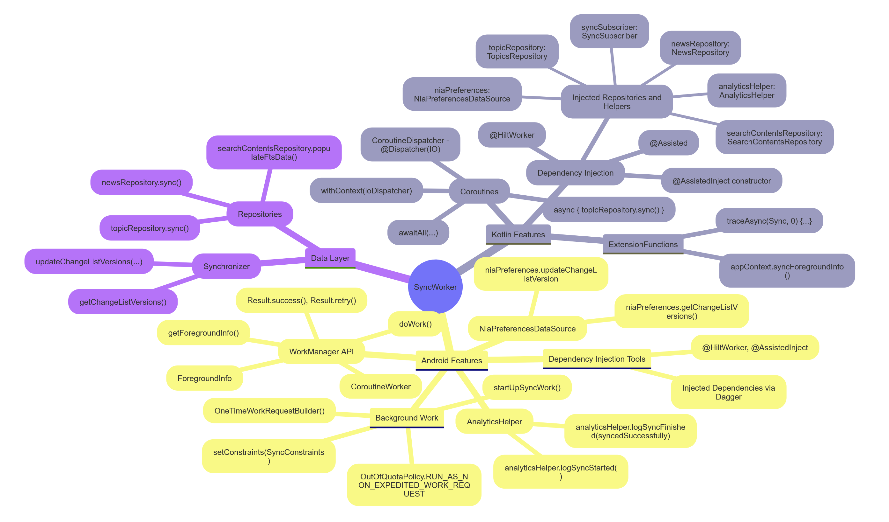

# Introduction

`Mindmaps` are an excellent way to visually represent and organize ideas, concepts, or information,
making them invaluable for understanding complex topics. Tools like `Mermaid` enhance this process
by enabling the creation of mindmaps through plain-text scripting. The `Mermaid Mindmaps` syntax
allows users to quickly define nodes and relationships, which is particularly beneficial for
developers and technical professionals.

I explored using an LLM (Large Language Model) to summarize source code I wanted to learn and
translate it into `Mermaid Mindmaps`. This approach helped me visualize the relationships between
various features and components of the codebase, providing a clearer understanding of its structure
and functionality. Combining the power of LLMs with `Mermaid` creates a dynamic and efficient
workflow for studying and documenting intricate systems.

[Mermaid Mindmaps Docs](https://mermaid.js.org/syntax/mindmap.html)

# An Example of Code That Could Have a Steep Learning Curve

The following code is from the `Now in Android` app project:
[SyncWorker](https://github.com/android/nowinandroid/blob/main/sync/work/src/main/kotlin/com/google/samples/apps/nowinandroid/sync/workers/SyncWorker.kt)

```kotlin
/**
 * Syncs the data layer by delegating to the appropriate repository instances with
 * sync functionality.
 */
@HiltWorker
internal class SyncWorker @AssistedInject constructor(
 @Assisted private val appContext: Context,
 @Assisted workerParams: WorkerParameters,
 private val niaPreferences: NiaPreferencesDataSource,
 private val topicRepository: TopicsRepository,
 private val newsRepository: NewsRepository,
 private val searchContentsRepository: SearchContentsRepository,
 @Dispatcher(IO) private val ioDispatcher: CoroutineDispatcher,
 private val analyticsHelper: AnalyticsHelper,
 private val syncSubscriber: SyncSubscriber,
) : CoroutineWorker(appContext, workerParams), Synchronizer {

 override suspend fun getForegroundInfo(): ForegroundInfo =
  appContext.syncForegroundInfo()

 override suspend fun doWork(): Result = withContext(ioDispatcher) {
  traceAsync("Sync", 0) {
   analyticsHelper.logSyncStarted()

   syncSubscriber.subscribe()

   // First sync the repositories in parallel
   val syncedSuccessfully = awaitAll(
    async { topicRepository.sync() },
    async { newsRepository.sync() },
   ).all { it }

   analyticsHelper.logSyncFinished(syncedSuccessfully)

   if (syncedSuccessfully) {
    searchContentsRepository.populateFtsData()
    Result.success()
   } else {
    Result.retry()
   }
  }
 }

 override suspend fun getChangeListVersions(): ChangeListVersions =
  niaPreferences.getChangeListVersions()

 override suspend fun updateChangeListVersions(
  update: ChangeListVersions.() -> ChangeListVersions,
 ) = niaPreferences.updateChangeListVersion(update)

 companion object {
  /**
   * Expedited one time work to sync data on app startup
   */
  fun startUpSyncWork() = OneTimeWorkRequestBuilder<DelegatingWorker>()
   .setExpedited(OutOfQuotaPolicy.RUN_AS_NON_EXPEDITED_WORK_REQUEST)
   .setConstraints(SyncConstraints)
   .setInputData(SyncWorker::class.delegatedData())
   .build()
 }
}
```

This code could be intimidating for developers who are not familiar with Dependency Injection (DI),
Workers, or Kotlin Coroutines due to its complexity and the advanced concepts it incorporates. The
use of `@HiltWorker` and `@AssistedInject` for DI adds a layer of abstraction that may not be
immediately clear to newcomers. Additionally, the interaction with the `Worker` API, particularly
the `doWork` method and the handling of background tasks using Coroutines (`withContext` and
`async`), requires an understanding of asynchronous programming patterns. Concepts like
`Dispatcher`, `ForegroundInfo`, and structured concurrency further add to the learning curve.

# Generate Mindmaps That Organize the Features Involved in the Code

If we could generate a `Mermaid Mindmap` to visually organize these components and their
relationships—such as how the `SyncWorker` interacts with repositories, Coroutines, DI, and
analytics—it could help developers break down the code into manageable parts and understand its flow
and dependencies more efficiently.

## The Prompt I Used

```text
Generate a Mermaid mindmap to organize all the Kotlin and Android features used in the code above. 
Include the source code lines or relevant parts of the lines in the mindmap nodes.
```

## The Raw Mindmap Code Generated

```text
mindmap
  root((SyncWorker))
    Kotlin Features
      CoroutineScope("Coroutines")
        Dispatcher("CoroutineDispatcher - @Dispatcher(IO)")
        async("async { topicRepository.sync() }")
        awaitAll("awaitAll(...)")
        withContext("withContext(ioDispatcher)")
      DI("Dependency Injection")
        HiltWorker("@HiltWorker")
        AssistedInject("@AssistedInject constructor")
        Assisted("@Assisted")
        DaggerInjection("Injected Repositories and Helpers")
          niaPreferences("niaPreferences: NiaPreferencesDataSource")
          topicRepository("topicRepository: TopicsRepository")
          newsRepository("newsRepository: NewsRepository")
          searchContentsRepository("searchContentsRepository: SearchContentsRepository")
          analyticsHelper("analyticsHelper: AnalyticsHelper")
          syncSubscriber("syncSubscriber: SyncSubscriber")
      ExtensionFunctions
        syncForegroundInfo("appContext.syncForegroundInfo()")
        traceAsync("traceAsync(Sync, 0) {...}")
    Android Features
      WorkManager("WorkManager API")
        CoroutineWorker("CoroutineWorker")
        getForegroundInfo("getForegroundInfo()")
        doWork("doWork()")
        Result("Result.success(), Result.retry()")
        ForegroundInfo("ForegroundInfo")
      PreferencesDataStore("NiaPreferencesDataSource")
        getChangeListVersions("niaPreferences.getChangeListVersions()")
        updateChangeListVersions("niaPreferences.updateChangeListVersion")
      Analytics("AnalyticsHelper")
        logSyncStarted("analyticsHelper.logSyncStarted()")
        logSyncFinished("analyticsHelper.logSyncFinished(syncedSuccessfully)")
      Background Work
        startUpSyncWork("startUpSyncWork()")
        OneTimeWorkRequestBuilder("OneTimeWorkRequestBuilder<DelegatingWorker>()")
        OutOfQuotaPolicy("OutOfQuotaPolicy.RUN_AS_NON_EXPEDITED_WORK_REQUEST")
        SyncConstraints("setConstraints(SyncConstraints)")
      Dependency Injection Tools
        Hilt("@HiltWorker, @AssistedInject")
        Dagger("Injected Dependencies via Dagger")
    Data Layer
      SynchronizerInterface("Synchronizer")
        getChangeListVersions("getChangeListVersions()")
        updateChangeListVersions("updateChangeListVersions(...)")
      Repositories("Repositories")
        topicRepository("topicRepository.sync()")
        newsRepository("newsRepository.sync()")
        searchContentsRepository("searchContentsRepository.populateFtsData()")
```

## Mindmap Generated by ChatGPT 4o


## Screenshot of the Mermaid Mindmap

A screenshot of the Mermaid Mindmap above is provided in case it cannot be displayed
properly in some browser


# Areas for Further Exploration

Something might be worth exploring is generating an interactive mindmap (not necessarily a `Mermaid`
mindmap) that can summarize an entire source code repository of an app. Such a mindmap could serve
as a comprehensive documentation solution, visually organizing the structure, features, and
relationships within the codebase. Each node in the mindmap could link directly to specific lines of
code or sections, providing developers with quick access to the underlying implementation.