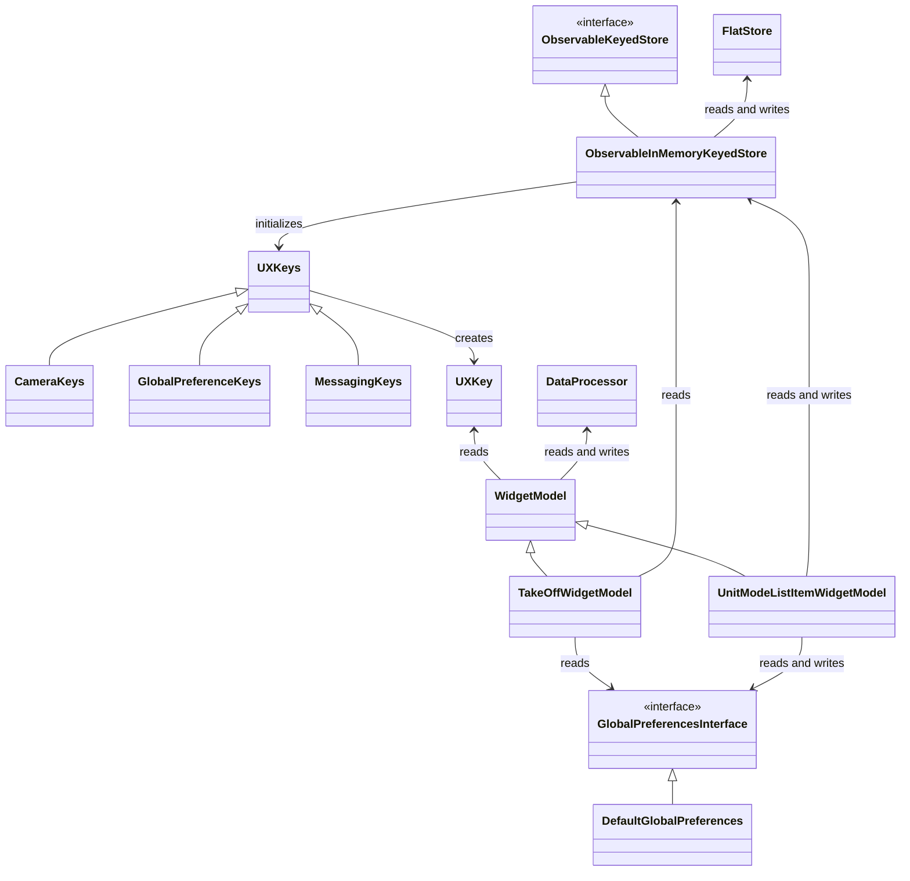
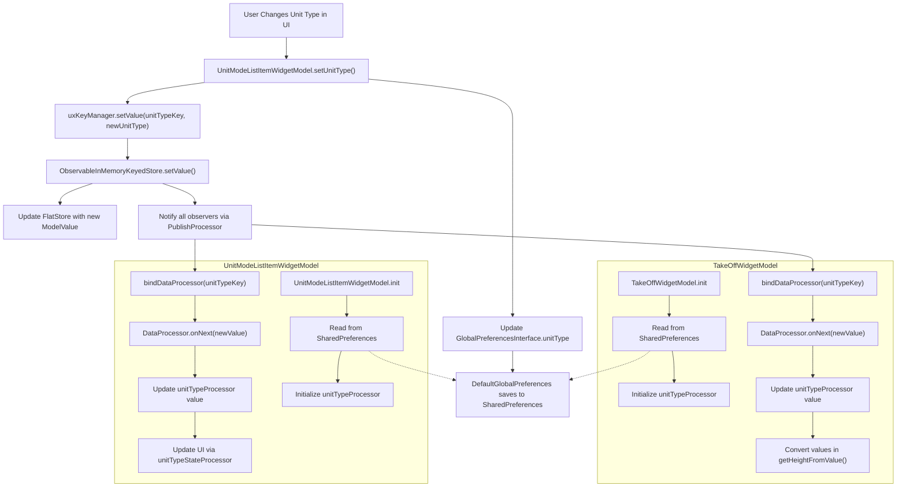
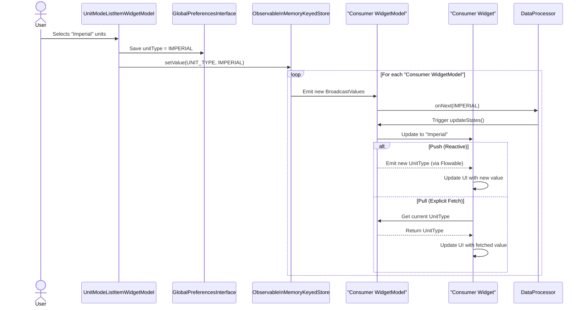

# Design Analysis: How `WidgetModels` Update and Consume `UXKeys`

This article examines how the `DJI Android SDK v5 UXSDK` manages user preferences like unit
conversions (metric/imperial) using two core components:

1. WidgetModels: Business logic controllers (e.g., `TakeOffWidgetModel`, `AltitudeWidgetModel`) that
   convert raw sensor data into UI-ready values.
2. UXKeys: Shared configuration parameters (e.g., `UNIT_TYPE`) stored in a reactive key-value
   store (`ObservableInMemoryKeyedStore`) and persisted via `SharedPreferences`.

We analyze a real-world implementation where:

- 1 producer (`UnitModeListItemWidgetModel`) updates the `UNIT_TYPE` key when the user changes unit
  preferences.
- 15+ consumer WidgetModels (e.g., altitude, distance, speed displays) reactively adapt their
  calculations to the current unit system.

The article explores:

- How dual data sources (`SharedPreferences` for persistence + `ObservableInMemoryKeyedStore` for
  real-time sync) work together.
- Why this architecture causes code duplication across WidgetModels.
- A proposed `UXDataSource` class to centralize data-source handling and reduce boilerplate.

### Table of Contents

[1. Introduction to WidgetModels and UXKeys](#1-introduction-to-widgetmodels-and-uxkeys)  
[2. Study Focus: The UnitType UXKey](#2-study-focus-the-unittype-uxkey)  
[3. Producer and Consumer Roles](#3-producer-and-consumer-roles)  
[4. Class Diagram Overview](#4-class-diagram-overview)  
[5. Dual Data Sources: Roles and Necessity](#5-dual-data-sources-roles-and-necessity)    
[6. Flowchart: Initialization and Runtime Observation](#6-flowchart-initialization-and-runtime-observation)     
[7. Sequence Diagram:UnitType Update to Imperial](#7-sequence-diagram-unittype-update-to-imperial)  
[8. Areas for Improvement in the Data Source Architecture](#8-areas-for-improvement-in-the-data-source-architecture)  
[9. Proposed Architecture: Centralized UXDataSource<T>](#9-proposed-architecture-centralized-uxdatasourcet)

# 1. Introduction to `WidgetModels` and `UXKeys`

## What are `WidgetModels`?

`WidgetModels` are core components in the `android-sdk-v5-uxsdk` project that act as intermediaries
between the UI (widgets) and the data layer. They:

- Encapsulate business logic (e.g., unit conversions, state management).
- Observe data sources (e.g., hardware sensors, user preferences).
- Expose reactive streams (via `DataProcessor`s) to drive UI updates.
- Bind to `UXKeys` to communicate with a centralized key-value store (
  `ObservableInMemoryKeyedStore`).

Example: `TakeOffWidgetModel` manages altitude calculations and binds to the `UNIT_TYPE` key to
handle metric/imperial conversions.

## What are `UXKeys`?

`UXKeys` are parameterized keys that define:

- A unique identifier (e.g., `"UnitType"`).
- The data type of the value they hold (e.g., `UnitConversionUtil.UnitType`).
- An update policy (`ON_CHANGE` or `ON_EVENT`).
- A hierarchical path (e.g., `"UnitType/0"`) for scoped storage.

They serve as a standardized way to:

- Store values in a global in-memory store (`FlatStore`).
- Propagate changes reactively to subscribed `WidgetModels`.
- Persist values via integration with `GlobalPreferencesInterface` (e.g., SharedPreferences).

# 2. Study Focus: The `UnitType` UXKey

This analysis focuses on how the `UNIT_TYPE` `UXKey` (representing the user’s preferred unit system)
is:

1. Updated by a single `WidgetModel` (`UnitModeListItemWidgetModel`).
2. Consumed by 15+ `WidgetModels` across the app (e.g., altitude, distance, velocity displays).

This pattern ensures centralized control over unit preferences while enabling decoupled consumption
across diverse UI components.

# 3. Producer and Consumer Roles

## Producer `WidgetModel`: `UnitModeListItemWidgetModel`

- Responsibility:
    - Updates the `UNIT_TYPE` key when the user selects a new unit system (e.g., metric/imperial).
    - Persists the value to `GlobalPreferencesInterface` (SharedPreferences).
    - Propagates the value to `ObservableInMemoryKeyedStore` for real-time distribution.
- Uniqueness:
    - Only this `WidgetModel` modifies `UNIT_TYPE`, ensuring a single source of truth for unit
      preferences.

## Consumer `WidgetModels`

These `WidgetModels` read the `UNIT_TYPE` key to adapt their logic but never modify it:

- `TakeOffWidgetModel`
- `ReturnHomeWidgetModel`
- `VPSWidgetModel`
- `VerticalVelocityWidgetModel`
- `HorizontalVelocityWidgetModel`
- `SystemStatusWidgetModel`
- `DistanceRCWidgetModel`
- `DistanceHomeWidgetModel`
- `AltitudeWidgetModel`
- `RTKSatelliteStatusWidgetModel`
- `ReturnToHomeAltitudeListItemWidgetModel`
- `MaxFlightDistanceListItemWidgetModel`
- `MaxAltitudeListItemWidgetModel`
- `AircraftBatteryTemperatureListItemWidgetModel`
- `RTKSatelliteStatusWidgetModel`

Key Behavior:

- Bind to the `UNIT_TYPE` key during initialization (`inSetup()`).
- Convert raw data (e.g., meters to feet) based on the current `UnitType`.
- Trigger UI updates via reactive `DataProcessor`s.

# 4. Class Diagram Overview

The class diagram below illustrates the relationships between key components involved in `UnitType`
management, focusing on:

- Producer: `UnitModeListItemWidgetModel` (sole updater of `UNIT_TYPE`).
- Consumer Example: `TakeOffWidgetModel` (one of many consumers).



## Producer-Consumer Relationship

- `UnitModeListItemWidgetModel` (Producer) writes to both `ObservableInMemoryKeyedStore` and
  `GlobalPreferencesInterface`.
- `TakeOffWidgetModel` (Consumer) reads from these sources but does not modify them.

## Data Sources

- `ObservableInMemoryKeyedStore`: A reactive, in-memory key-value store for real-time data
  synchronization.
- `GlobalPreferencesInterface`: A persisted preferences interface (e.g., SharedPreferences) for
  retaining values across app sessions.

# 5. Dual Data Sources: Roles and Necessity

## ObservableInMemoryKeyedStore

- Purpose:
    - Acts as a centralized, real-time communication channel for `UXKey` values.
    - Uses reactive streams (e.g., RxJava `Flowable`) to notify consumers of changes instantly.
- Use Case:
    - When `UnitModeListItemWidgetModel` updates `UNIT_TYPE`, the store propagates the new value to
      all bound `WidgetModels` (e.g., `TakeOffWidgetModel`), triggering UI refreshes.
- Lifetime:
    - Values exist only in memory and are cleared when the app terminates.

## GlobalPreferencesInterface

- Purpose:
    - Persists critical preferences (e.g., `UnitType`) to device storage (via
      `DefaultGlobalPreferences`).
    - Ensures values survive app restarts or device reboots.
- Use Case:
    - When the user selects "Imperial" units, `UnitModeListItemWidgetModel` saves the choice here,
      ensuring it remains active in future sessions.

## Why Two Sources Are Needed

### Real-Time vs. Persistence

- `ObservableInMemoryKeyedStore` enables immediate, efficient updates across the app.
- `GlobalPreferencesInterface` guarantees long-term consistency for user preferences.

### Separation of Concerns

- In-Memory Store: Optimized for fast read/write operations and reactive programming.
- Persisted Preferences: Focused on data durability and retrieval across app launches.

### Producer Workflow

- When `UnitModeListItemWidgetModel` updates `UNIT_TYPE`, it writes to both sources:
  ```kotlin
  fun setUnitType(unitType: UnitType): Completable {
      // ...
      preferencesManager.unitType = unitType // Persist to GlobalPreferencesInterface
      return uxKeyManager.setValue(unitTypeKey, unitType) // Update ObservableInMemoryKeyedStore
  }
  ```  
- This ensures atomic consistency between runtime state and saved preferences.

### Consumer Workflow

- Initialization:
    - On startup, `TakeOffWidgetModel` reads `GlobalPreferencesInterface` to load the last saved
      `UnitType`.
- Runtime:
    - Binds to `ObservableInMemoryKeyedStore` to reactively receive updates.

# 6. Flowchart: Initialization and Runtime Observation

The flowchart below captures the lifecycle of `UnitType` management, highlighting two critical
phases: Initialization (reading persisted preferences) and Runtime (observing real-time updates).



## Initialization Flow

- Step: During `TakeOffWidgetModel.init` and `UnitModeListItemWidgetModel.init`, both read
  `UnitType` from `SharedPreferences` via `DefaultGlobalPreferences`.
- Purpose: Restores the user’s last-selected unit type (e.g., from a previous session).

## Runtime Observation Flow

- Step: When `UnitType` changes, `ObservableInMemoryKeyedStore` updates `FlatStore` and notifies
  observers via `PublishProcessor`.
- Impact:
    - `TakeOffWidgetModel` converts raw data (e.g., meters → feet) using `getHeightFromValue()`.
    - `UnitModeListItemWidgetModel` updates its UI state to reflect the new selection.

# 7. Sequence Diagram: UnitType Update to Imperial

The sequence diagram below illustrates the end-to-end flow when the user selects "Imperial" units:



The sequence diagram above illustrates the end-to-end flow when a user updates the `UnitType` to
`IMPERIAL` and the downstream operations triggered across the system. Here, the `Consumer
WidgetModel` refers to any of the 15+ `WidgetModels` (e.g., `TakeOffWidgetModel`,
`AltitudeWidgetModel`) that consume the `UnitType` value but do not modify it. Each
`Consumer WidgetModel` is paired with a `Consumer Widget` (e.g., `TakeOffWidget`,
`AltitudeWidget`), which is the Android UI component responsible for displaying some unit-specific
data.

## Key Steps

1. User Action: The user selects "Imperial" units via `UnitModeListItemWidgetModel` (the sole
   `Producer WidgetModel`)
2. Persistence:
    - `UnitModeListItemWidgetModel` saves the new `UnitType` to `GlobalPreferencesInterface` (
      SharedPreferences).
    - This ensures the preference persists across app restarts.
3. In-Memory Update:
    - The new `UnitType` is written to `ObservableInMemoryKeyedStore`, triggering a reactive
      broadcast to all observers.
4. Consumer Notification:
    - Each `Consumer WidgetModel` (e.g., `TakeOffWidgetModel`) receives the update via its
      `DataProcessor`.
    - The `DataProcessor` triggers `updateStates()`, recalculating unit-dependent values (e.g.,
      converting meters to feet).
5. UI Refresh:
    - Push Mechanism: The `Consumer Widget` reacts to a reactive stream (`Flowable`) and redraws.
    - Pull Mechanism: The `Consumer Widget` (e.g., `TakeOffWidget`) explicitly fetches the latest
      `UnitType`.

## This architecture ensures:

- Persistence: `UnitType` survives app restarts via `SharedPreferences`.
- Realtime Sync: Changes propagate instantly to all consumers via reactive streams.

# 8. Areas for Improvement in the Data Source Architecture

One noticeable issue in the data source architecture is that the `Unit Type` property is retrieved
in each of the 16 `WidgetModels` from two sources:

1. The `GlobalPreferencesInterface` (for persisted settings, via `DefaultGlobalPreferences`), and
2. The `ObservableInMemoryKeyedStore` (for reactive, real-time updates through `UXKey`).

Specifically, each `WidgetModel` does the following:

- Reads the current `Unit Type` from the `GlobalPreferencesInterface` (the shared preferences
  setup).
- Binds the same `GlobalPreferenceKeys.UNIT_TYPE` key to the same
  `DataProcessor<UnitConversionUtil.UnitType>` field created in each `WidgetModel`.

This leads to a few drawbacks:

1. Code Duplication: Each widget model has boilerplate code that fetches and binds the same
   value from the two different sources.
2. Maintenance Overhead: Having to manage both persisted and real-time data in every widget
   model makes the codebase harder to maintain and scale. Any changes to how unit type is read or
   updated need to be reflected in multiple places.
3. Single Source of Truth Violation: Ideally, each piece of data in the system should come from
   a single, clearly defined source. In this setup, the same data is effectively owned by both the
   preferences manager and the in-memory keyed store.

# 9. Proposed Architecture: Centralized `UXDataSource<T>`

To streamline the management of `UnitType` (and similar preferences), a `UXDataSource<T>` class
can be introduced to encapsulate interactions with both data sources (`GlobalPreferencesInterface`
and `ObservableInMemoryKeyedStore`). The class operates as follows:

### Key Features

- For `UnitType`: Instantiate as `UXDataSource<UnitType>` to handle reads/writes for the `UNIT_TYPE`
  key.

- Dependency Injection: Inject `UXDataSource<UnitType>` into all `Producer WidgetModels` and
  `Consumer WidgetModels`.
    - Simplification: `GlobalPreferencesInterface` and `ObservableInMemoryKeyedStore` no longer need
      direct injection into `WidgetModels`.

- Producer Workflow: `Producer WidgetModels` (e.g., `UnitModeListItemWidgetModel`) call
  `setUnitType(unitType: UnitType, persist: Boolean = true)` to update the value.
    - Persistent Updates (`persist = true`): Writes to both `GlobalPreferencesInterface` (
      SharedPreferences) and `ObservableInMemoryKeyedStore` (e.g., user-selected units).
    - Ephemeral Updates (`persist = false`): Writes only to `ObservableInMemoryKeyedStore` (
      e.g., temporary debug overrides).

- Consumer Workflow: The `UXDataSource<UnitType>` creates and exposes a
  `val unitTypeProcessor: DataProcessor<UnitType>`, allowing `Consumer WidgetModels` (e.g.,
  `TakeOffWidgetModel`) to subscribe to the `Flowable<UnitType>` for push-based updates or access
  the current value via the `DataProcessor.getValue()` method.

### Benefits

- Reduced Redundancy: Eliminates duplicate code in `WidgetModels` for dual-source synchronization.
- Centralized Logic: Encapsulates persistence rules (e.g., when to write to SharedPreferences vs.
  in-memory storage).
- Improved Maintainability: Changes to data sources (e.g., replacing `SharedPreferences` with
  `Room DB`) only affect `UXDataSource`.
- Explicit Control: Decouples `WidgetModels` from storage implementation details, adhering to the
  Single Responsibility Principle.
- Flexibility: Supports both persistent and ephemeral updates through method parameters (e.g.,
  `persist: Boolean`).

