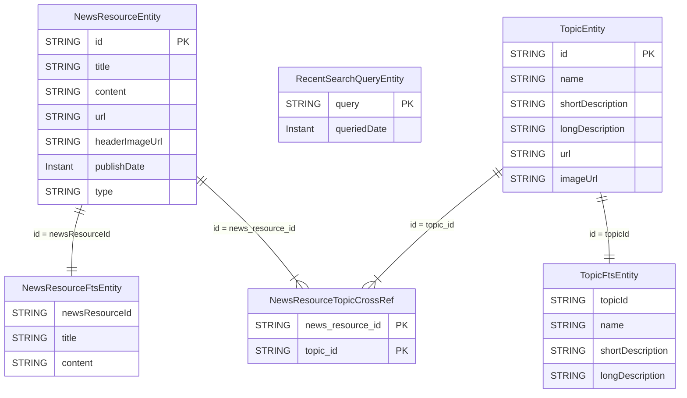

# Introduction

This article demonstrates how to complex data relationships using a `Mermaid Entity Relationship 
(ER) Diagram` and leverage a `Large Language Model (LLM)` to generate `Android Kotlin` code based on
the diagram. The process begins by converting existing `Kotlin` code into a `Mermaid ER Diagram`,
visually representing the structure and relationships between data entities. The article then
explores how the `LLM` can reverse the process by generating `Kotlin` code directly from the
`ER Diagram`.

# Generate Mermaid Entity Relationship Diagram according to Source Code

An `Entity Relationship Diagram (ER Diagram)` is a powerful tool for modeling the static structure
of a database by representing its `entities`, `attributes`, and `relationships`. It is ideal for
visualizing how data is organized, how entities interact with one another, and the cardinality of
their relationships. `ER Diagrams` are commonly used in database design and system analysis to
ensure data integrity, clarify requirements, and communicate database structures to developers and
stakeholders. A `Mermaid Entity Relationship Diagram` enables users to define and visualize
`ER Diagrams` using simple text-based syntax. This approach makes it easy to integrate the diagrams
into documentation, automate updates, and maintain a clear, shared understanding of data
relationships in dynamic projects.

From Android source code, it might not be easy to clearly see the `Entity Relationship (ER)`
structure, especially when working with complex codebases. We can use `Large Language Model (LLM)`
to convert the source code into a `Mermaid Entity Relationship Diagram`. This approach helps to
visualize the relationships between entities, attributes, and associations in a clear and structured
way, making it easier to understand the underlying data architecture.

The following is an example using `@Entity` classes from the `Now in Android` app, demonstrating how
`LLMs` can bridge the gap between raw code and intuitive visual documentation.

## The Prompt I Used

```text
/**
 * Defines an NiA news resource.
 */
@Entity(
    tableName = "news_resources",
)
data class NewsResourceEntity(
    @PrimaryKey
    val id: String,
    val title: String,
    val content: String,
    val url: String,
    @ColumnInfo(name = "header_image_url")
    val headerImageUrl: String?,
    @ColumnInfo(name = "publish_date")
    val publishDate: Instant,
    val type: String,
)

fun NewsResourceEntity.asExternalModel() = NewsResource(
    id = id,
    title = title,
    content = content,
    url = url,
    headerImageUrl = headerImageUrl,
    publishDate = publishDate,
    type = type,
    topics = listOf(),
)

/**
 * Fts entity for the news resources. See https://developer.android.com/reference/androidx/room/Fts4.
 */
@Entity(tableName = "newsResourcesFts")
@Fts4
data class NewsResourceFtsEntity(

    @ColumnInfo(name = "newsResourceId")
    val newsResourceId: String,

    @ColumnInfo(name = "title")
    val title: String,

    @ColumnInfo(name = "content")
    val content: String,
)

/**
 * Cross reference for many to many relationship between [NewsResourceEntity] and [TopicEntity]
 */
@Entity(
    tableName = "news_resources_topics",
    primaryKeys = ["news_resource_id", "topic_id"],
    foreignKeys = [
        ForeignKey(
            entity = NewsResourceEntity::class,
            parentColumns = ["id"],
            childColumns = ["news_resource_id"],
            onDelete = ForeignKey.CASCADE,
        ),
        ForeignKey(
            entity = TopicEntity::class,
            parentColumns = ["id"],
            childColumns = ["topic_id"],
            onDelete = ForeignKey.CASCADE,
        ),
    ],
    indices = [
        Index(value = ["news_resource_id"]),
        Index(value = ["topic_id"]),
    ],
)
data class NewsResourceTopicCrossRef(
    @ColumnInfo(name = "news_resource_id")
    val newsResourceId: String,
    @ColumnInfo(name = "topic_id")
    val topicId: String,
)

/**
 * External data layer representation of a fully populated NiA news resource
 */
data class PopulatedNewsResource(
    @Embedded
    val entity: NewsResourceEntity,
    @Relation(
        parentColumn = "id",
        entityColumn = "id",
        associateBy = Junction(
            value = NewsResourceTopicCrossRef::class,
            parentColumn = "news_resource_id",
            entityColumn = "topic_id",
        ),
    )
    val topics: List<TopicEntity>,
)

fun PopulatedNewsResource.asExternalModel() = NewsResource(
    id = entity.id,
    title = entity.title,
    content = entity.content,
    url = entity.url,
    headerImageUrl = entity.headerImageUrl,
    publishDate = entity.publishDate,
    type = entity.type,
    topics = topics.map(TopicEntity::asExternalModel),
)

fun PopulatedNewsResource.asFtsEntity() = NewsResourceFtsEntity(
    newsResourceId = entity.id,
    title = entity.title,
    content = entity.content,
)

/**
 * Defines an database entity that stored recent search queries.
 */
@Entity(
    tableName = "recentSearchQueries",
)
data class RecentSearchQueryEntity(
    @PrimaryKey
    val query: String,
    @ColumnInfo
    val queriedDate: Instant,
)

/**
 * Defines a topic a user may follow.
 * It has a many to many relationship with [NewsResourceEntity]
 */
@Entity(
    tableName = "topics",
)
data class TopicEntity(
    @PrimaryKey
    val id: String,
    val name: String,
    val shortDescription: String,
    @ColumnInfo(defaultValue = "")
    val longDescription: String,
    @ColumnInfo(defaultValue = "")
    val url: String,
    @ColumnInfo(defaultValue = "")
    val imageUrl: String,
)

fun TopicEntity.asExternalModel() = Topic(
    id = id,
    name = name,
    shortDescription = shortDescription,
    longDescription = longDescription,
    url = url,
    imageUrl = imageUrl,
)


/**
 * Fts entity for the topic. See https://developer.android.com/reference/androidx/room/Fts4.
 */
@Entity(tableName = "topicsFts")
@Fts4
data class TopicFtsEntity(

    @ColumnInfo(name = "topicId")
    val topicId: String,

    @ColumnInfo(name = "name")
    val name: String,

    @ColumnInfo(name = "shortDescription")
    val shortDescription: String,

    @ColumnInfo(name = "longDescription")
    val longDescription: String,
)

fun TopicEntity.asFtsEntity() = TopicFtsEntity(
    topicId = id,
    name = name,
    shortDescription = shortDescription,
    longDescription = longDescription,
)

---Generate a Mermaid Entity Relationship Diagram based on the source code above.
```

The source code in the prompt above are copied from
[Now In Android app's @Entity data classes](https://github.com/android/nowinandroid/tree/main/core/database/src/main/kotlin/com/google/samples/apps/nowinandroid/core/database/model)

## The Raw Code of the Mermaid Entity Relationship Diagram Generated by ChatGPT o1

```text
erDiagram

%% ------------------------
%% NewsResourceEntity
%% ------------------------
    NewsResourceEntity {
        STRING id PK
        STRING title
        STRING content
        STRING url
        STRING headerImageUrl
        Instant publishDate
        STRING type
    }

%% ------------------------
%% NewsResourceFtsEntity
%% ------------------------
    NewsResourceFtsEntity {
        STRING newsResourceId
        STRING title
        STRING content
    }

%% ------------------------
%% NewsResourceTopicCrossRef
%% ------------------------
    NewsResourceTopicCrossRef {
        STRING news_resource_id PK
        STRING topic_id PK
    }

%% ------------------------
%% RecentSearchQueryEntity
%% ------------------------
    RecentSearchQueryEntity {
        STRING query PK
        Instant queriedDate
    }

%% ------------------------
%% TopicEntity
%% ------------------------
    TopicEntity {
        STRING id PK
        STRING name
        STRING shortDescription
        STRING longDescription
        STRING url
        STRING imageUrl
    }

%% ------------------------
%% TopicFtsEntity
%% ------------------------
    TopicFtsEntity {
        STRING topicId
        STRING name
        STRING shortDescription
        STRING longDescription
    }

%% ------------------------------------------------
%% Relationships
%% ------------------------------------------------

%% NewsResourceEntity
    NewsResourceEntity ||--|| NewsResourceFtsEntity: "id = newsResourceId"
    NewsResourceEntity ||--|{ NewsResourceTopicCrossRef: "id = news_resource_id"
%% TopicEntity
    TopicEntity ||--|| TopicFtsEntity: "id = topicId"
    TopicEntity ||--|{ NewsResourceTopicCrossRef: "id = topic_id"
```

## Mermaid Entity Relationship Diagram Generated by ChatGPT o1



## Screenshot of the Mermaid Entity Relationship Diagram

A screenshot of the Mermaid Entity Relationship Diagram above is provided in case it cannot be
displayed properly in some browser:


# Generate Android Kotlin Code from Mermaid ER Diagram

With a `Mermaid Entity Relationship Diagram`, it becomes much easier to visualize entity
relationships in a clear and organized manner. The diagram can be edited to add new tables, change
their relationships, and immediately see the modifications represented visually. This interactive
process not only aids understanding but also streamlines updates to the data model. Once the
`ER Diagram` is modified, we can use `Large Language Models (LLMs)` to generate `Kotlin` code from
the updated diagram, ensuring consistency between design and implementation. In this case, I did not
modify the `ER Diagram`, allowing for a direct comparison between the generated `Kotlin` code and
the original source code.

> [!NOTE]
> Run the following code generation prompt in a new thread so that the LLM wouldn't just copy the
> source code you provided earlier.

## The Prompt I Used

```text
erDiagram

%% ------------------------
%% NewsResourceEntity
%% ------------------------
    NewsResourceEntity {
        STRING id PK
        STRING title
        STRING content
        STRING url
        STRING headerImageUrl
        Instant publishDate
        STRING type
    }

%% ------------------------
%% NewsResourceFtsEntity
%% ------------------------
    NewsResourceFtsEntity {
        STRING newsResourceId
        STRING title
        STRING content
    }

%% ------------------------
%% NewsResourceTopicCrossRef
%% ------------------------
    NewsResourceTopicCrossRef {
        STRING news_resource_id PK
        STRING topic_id PK
    }

%% ------------------------
%% RecentSearchQueryEntity
%% ------------------------
    RecentSearchQueryEntity {
        STRING query PK
        Instant queriedDate
    }

%% ------------------------
%% TopicEntity
%% ------------------------
    TopicEntity {
        STRING id PK
        STRING name
        STRING shortDescription
        STRING longDescription
        STRING url
        STRING imageUrl
    }

%% ------------------------
%% TopicFtsEntity
%% ------------------------
    TopicFtsEntity {
        STRING topicId
        STRING name
        STRING shortDescription
        STRING longDescription
    }

%% ------------------------------------------------
%% Relationships
%% ------------------------------------------------

%% NewsResourceEntity
    NewsResourceEntity ||--|| NewsResourceFtsEntity: "id = newsResourceId"
    NewsResourceEntity ||--|{ NewsResourceTopicCrossRef: "id = news_resource_id"
%% TopicEntity
    TopicEntity ||--|| TopicFtsEntity: "id = topicId"
    TopicEntity ||--|{ NewsResourceTopicCrossRef: "id = topic_id"

---Based on the Mermaid ER diagram above, generate Kotlin @Entity data classes
```

## Code Generated by ChatGPT 4o

```kotlin
@Entity
data class NewsResourceEntity(
 @PrimaryKey val id: String,
 val title: String,
 val content: String,
 val url: String,
 val headerImageUrl: String,
 val publishDate: Instant,
 val type: String
)

@Entity(
 foreignKeys = [
  ForeignKey(
   entity = NewsResourceEntity::class,
   parentColumns = ["id"],
   childColumns = ["newsResourceId"],
   onDelete = ForeignKey.CASCADE
  )
 ]
)
data class NewsResourceFtsEntity(
 @ColumnInfo(index = true) val newsResourceId: String,
 val title: String,
 val content: String
)

@Entity(
 primaryKeys = ["news_resource_id", "topic_id"],
 foreignKeys = [
  ForeignKey(
   entity = NewsResourceEntity::class,
   parentColumns = ["id"],
   childColumns = ["news_resource_id"],
   onDelete = ForeignKey.CASCADE
  ),
  ForeignKey(
   entity = TopicEntity::class,
   parentColumns = ["id"],
   childColumns = ["topic_id"],
   onDelete = ForeignKey.CASCADE
  )
 ]
)
data class NewsResourceTopicCrossRef(
 @ColumnInfo(name = "news_resource_id") val newsResourceId: String,
 @ColumnInfo(name = "topic_id") val topicId: String
)

@Entity
data class RecentSearchQueryEntity(
 @PrimaryKey val query: String,
 val queriedDate: Instant
)

@Entity
data class TopicEntity(
 @PrimaryKey val id: String,
 val name: String,
 val shortDescription: String,
 val longDescription: String,
 val url: String,
 val imageUrl: String
)

@Entity(
 foreignKeys = [
  ForeignKey(
   entity = TopicEntity::class,
   parentColumns = ["id"],
   childColumns = ["topicId"],
   onDelete = ForeignKey.CASCADE
  )
 ]
)
data class TopicFtsEntity(
 @ColumnInfo(index = true) val topicId: String,
 val name: String,
 val shortDescription: String,
 val longDescription: String
)
```

## Code and Explanation Generated by ChatGPT o1 (A Very Long Reply)

Below is an example of how you might represent each table as a Kotlin data class annotated with
Room’s `@Entity`. The code includes reasonable defaults for field naming, primary keys, foreign
keys, and indices based on the relationships shown in the Mermaid diagram.

> **Note**:
> 1. Room does not directly support `Instant`; you will need
     a [TypeConverter](https://developer.android.com/reference/android/arch/persistence/room/TypeConverter)
     to store an `Instant` (often as a `Long` representing epoch milliseconds, or as a `String`).
> 2. Adjust table names and column names (via `tableName`, `ColumnInfo`) to match your needs or
     naming conventions.
> 3. The sample below assumes you want to enforce foreign keys. If you do not need foreign keys, you
     can remove the `foreignKeys` attributes and related indices.

### 1. `NewsResourceEntity`

```kotlin
import androidx.room.Entity
import androidx.room.PrimaryKey
import java.time.Instant

@Entity(tableName = "news_resource_entity")
data class NewsResourceEntity(
 @PrimaryKey
 val id: String,
 val title: String,
 val content: String,
 val url: String?,
 val headerImageUrl: String?,
 val publishDate: Instant?,
 val type: String?
)
```

### 2. `NewsResourceFtsEntity`

Since the diagram shows a one-to-one relationship between `NewsResourceEntity` and
`NewsResourceFtsEntity` (`id = newsResourceId`), we can make `newsResourceId` the primary key and
link it back to `NewsResourceEntity`:

```kotlin
import androidx.room.Entity
import androidx.room.ForeignKey
import androidx.room.Index
import androidx.room.PrimaryKey

@Entity(
 tableName = "news_resource_fts_entity",
 foreignKeys = [
  ForeignKey(
   entity = NewsResourceEntity::class,
   parentColumns = ["id"],
   childColumns = ["newsResourceId"],
   onDelete = ForeignKey.CASCADE
  )
 ],
 indices = [Index("newsResourceId")]
)
data class NewsResourceFtsEntity(
 @PrimaryKey
 val newsResourceId: String,
 val title: String,
 val content: String
)
```

### 3. `NewsResourceTopicCrossRef`

The diagram indicates a many-to-many relationship between `NewsResourceEntity` and `TopicEntity` via
a cross-reference table. Both columns (`news_resource_id` and `topic_id`) together serve as the
composite primary key:

```kotlin
import androidx.room.Entity
import androidx.room.ForeignKey
import androidx.room.Index

@Entity(
 tableName = "news_resource_topic_cross_ref",
 primaryKeys = ["news_resource_id", "topic_id"],
 foreignKeys = [
  ForeignKey(
   entity = NewsResourceEntity::class,
   parentColumns = ["id"],
   childColumns = ["news_resource_id"],
   onDelete = ForeignKey.CASCADE
  ),
  ForeignKey(
   entity = TopicEntity::class,
   parentColumns = ["id"],
   childColumns = ["topic_id"],
   onDelete = ForeignKey.CASCADE
  )
 ],
 indices = [
  Index("news_resource_id"),
  Index("topic_id")
 ]
)
data class NewsResourceTopicCrossRef(
 val news_resource_id: String,
 val topic_id: String
)
```

### 4. `RecentSearchQueryEntity`

```kotlin
import androidx.room.Entity
import androidx.room.PrimaryKey
import java.time.Instant

@Entity(tableName = "recent_search_query_entity")
data class RecentSearchQueryEntity(
 @PrimaryKey
 val query: String,
 val queriedDate: Instant?
)
```

### 5. `TopicEntity`

```kotlin
import androidx.room.Entity
import androidx.room.PrimaryKey

@Entity(tableName = "topic_entity")
data class TopicEntity(
 @PrimaryKey
 val id: String,
 val name: String,
 val shortDescription: String?,
 val longDescription: String?,
 val url: String?,
 val imageUrl: String?
)
```

### 6. `TopicFtsEntity`

Like `NewsResourceFtsEntity`, this indicates a one-to-one relationship with `TopicEntity`. Thus,
`topicId` is the primary key and references `TopicEntity.id`:

```kotlin
import androidx.room.Entity
import androidx.room.ForeignKey
import androidx.room.Index
import androidx.room.PrimaryKey

@Entity(
 tableName = "topic_fts_entity",
 foreignKeys = [
  ForeignKey(
   entity = TopicEntity::class,
   parentColumns = ["id"],
   childColumns = ["topicId"],
   onDelete = ForeignKey.CASCADE
  )
 ],
 indices = [Index("topicId")]
)
data class TopicFtsEntity(
 @PrimaryKey
 val topicId: String,
 val name: String,
 val shortDescription: String?,
 val longDescription: String?
)
```

### Handling `Instant`

Room does not natively store Java `Instant` fields. You will need to provide
a [TypeConverter](https://developer.android.com/training/data-storage/room/referencing-data#type-converters).
For example:

```kotlin
import androidx.room.TypeConverter
import java.time.Instant

class Converters {
 @TypeConverter
 fun fromInstant(value: Instant?): Long? {
  return value?.toEpochMilli()
 }

 @TypeConverter
 fun toInstant(value: Long?): Instant? {
  return value?.let { Instant.ofEpochMilli(it) }
 }
}
```

Then, add this converter to your `RoomDatabase`:

```kotlin
import androidx.room.Database
import androidx.room.RoomDatabase
import androidx.room.TypeConverters

@Database(
 entities = [
  NewsResourceEntity::class,
  NewsResourceFtsEntity::class,
  NewsResourceTopicCrossRef::class,
  RecentSearchQueryEntity::class,
  TopicEntity::class,
  TopicFtsEntity::class
 ],
 version = 1,
 exportSchema = false
)
@TypeConverters(Converters::class)
abstract class AppDatabase : RoomDatabase() {
 // Define DAOs here
}
```

With that, Room will correctly convert between `Instant` and the `Long` timestamp in the database.

### Final Notes

1. **Table Names**: Adjust `tableName` in each `@Entity` annotation if you prefer different naming
   conventions.
2. **Column Names**: You can specify `@ColumnInfo(name = "custom_column_name")` if you want the
   columns in the database to have different names than your Kotlin properties.
3. **Foreign Key Actions**: The sample sets `onDelete = ForeignKey.CASCADE`, meaning when a parent
   row is deleted, the child row(s) will also be deleted. Adjust according to your business logic
   needs.
4. **Indices**: Indices help with query performance; the example includes them for foreign key
   columns. Depending on your queries, you might add more indices.

This setup should closely match the diagram’s schema while working smoothly with the Room
persistence library.

# Areas for Further Exploration

Future work can explore enhancing this pipeline by incorporating automated database schema
migrations, validating diagram-code consistency, and integrating interactive tools for real-time
updates between diagrams and code.