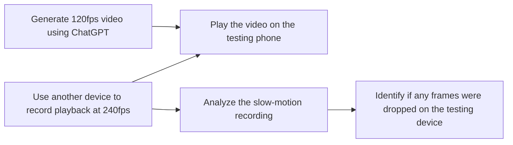

# Generate Python Code and Video Using ChatGPT

I once wanted to test the video playback performance of an Android device to determine if it could
handle 1080p video at 120 frames per second without dropping frames. To achieve this, I decided to
use `ChatGPT` to generate a video that runs at 120fps. My plan was to play this video on the testing
phone and use another device capable of capturing ultra-slow-motion videos (at 240fps, for example)
to record the playback. By watching the slow-motion recording, I could visually check the playback
on the testing device to identify whether any frames were dropped during the process.

[An example of a phone that supports ultra-slow-motion video capturing](https://www.samsung.com/us/support/answer/ANS10001595/)

The testing process can be illustrated using a `Mermaid flowchart` as shown below:



## The Prompt I Used

```text
Write a Python function to generate a 5-second-long video with the following specifications:

- The video has a resolution of 1080p.
- The video runs at 120 frames per second (fps).
- Each frame displays a number at the center of the screen, counting from 1 to 600 before 
  restarting from 1. This sequence repeats continuously. 
- Each frame includes 100 random shapes in the background, each with a unique color. The shapes 
  are regenerated for every frame. 

After writing the function, run it and generate the video.
```

## Python Code Generated by ChatGPT 4o

```python
import cv2
import numpy as np

def generate_video(output_filename="output_video.mp4"):
    # Video specifications
    resolution = (1920, 1080)  # 1080p
    fps = 120
    duration = 5  # seconds
    total_frames = fps * duration

    # Video writer setup
    fourcc = cv2.VideoWriter_fourcc(*"mp4v")  # Codec for .mp4
    out = cv2.VideoWriter(output_filename, fourcc, fps, resolution)

    for frame_num in range(total_frames):
        # Create a blank image
        frame = np.zeros((resolution[1], resolution[0], 3), dtype=np.uint8)

        # Generate 100 random shapes with unique colors
        for _ in range(100):
            color = tuple(np.random.randint(0, 256, size=3).tolist())
            shape_type = np.random.choice(["circle", "rectangle"])
            if shape_type == "circle":
                center = (np.random.randint(0, resolution[0]), np.random.randint(0, resolution[1]))
                radius = np.random.randint(10, 50)
                cv2.circle(frame, center, radius, color, -1)
            else:  # rectangle
                pt1 = (np.random.randint(0, resolution[0]), np.random.randint(0, resolution[1]))
                pt2 = (pt1[0] + np.random.randint(20, 100), pt1[1] + np.random.randint(20, 100))
                cv2.rectangle(frame, pt1, pt2, color, -1)

        # Calculate the number to display
        display_number = (frame_num % 600) + 1

        # Put the number at the center of the frame
        font = cv2.FONT_HERSHEY_SIMPLEX
        font_scale = 5
        font_thickness = 10
        text = str(display_number)
        text_size = cv2.getTextSize(text, font, font_scale, font_thickness)[0]
        text_x = (resolution[0] - text_size[0]) // 2
        text_y = (resolution[1] + text_size[1]) // 2
        cv2.putText(frame, text, (text_x, text_y), font, font_scale, (255, 255, 255), font_thickness)

        # Write the frame to the video
        out.write(frame)

    # Release the video writer
    out.release()

# Generate the video
generate_video("output_video.mp4")
```

## Explanation Generated by ChatGPT 4o

Generating a 5-second-long video at 120 frames per second (fps) with the given specifications
involves a complex pipeline. Here's a breakdown of what we will do:

1. Use Python libraries like `opencv` for video generation and `numpy` for creating shapes and
   graphics.
2. Randomly generate 100 shapes for each frame and overlay a number at the center.
3. Save the video using the `cv2.VideoWriter`.

Let's first write the Python function, and then I'll execute it to generate the video.

The function `generate_video` creates a 5-second-long video as per the specified requirements. It
saves the output to a file named `output_video.mp4`. Let me now run the code to generate the video.

The video has been successfully generated and saved as `output_video.mp4`. You
can [download it here](sandbox:/mnt/data/output_video.mp4) to view the final output.

## Video Generated by ChatGPT 4o

[Download the video from my Google Drive](https://drive.google.com/file/d/1E8ntqBP8eV6l5UTrdH7cljYRoUvmSNrL/view?usp=sharing)