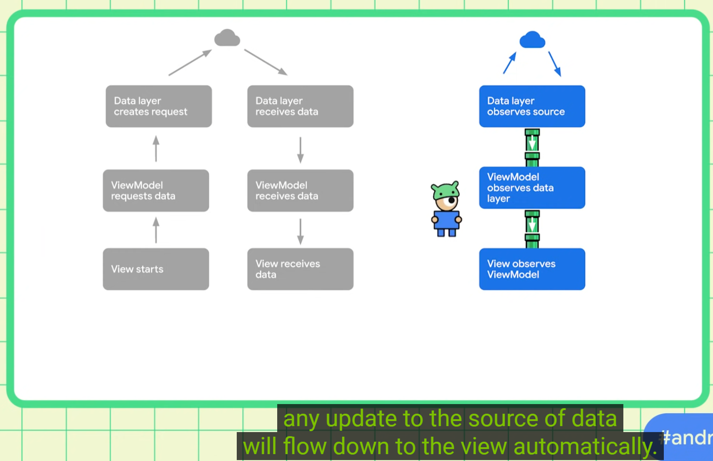
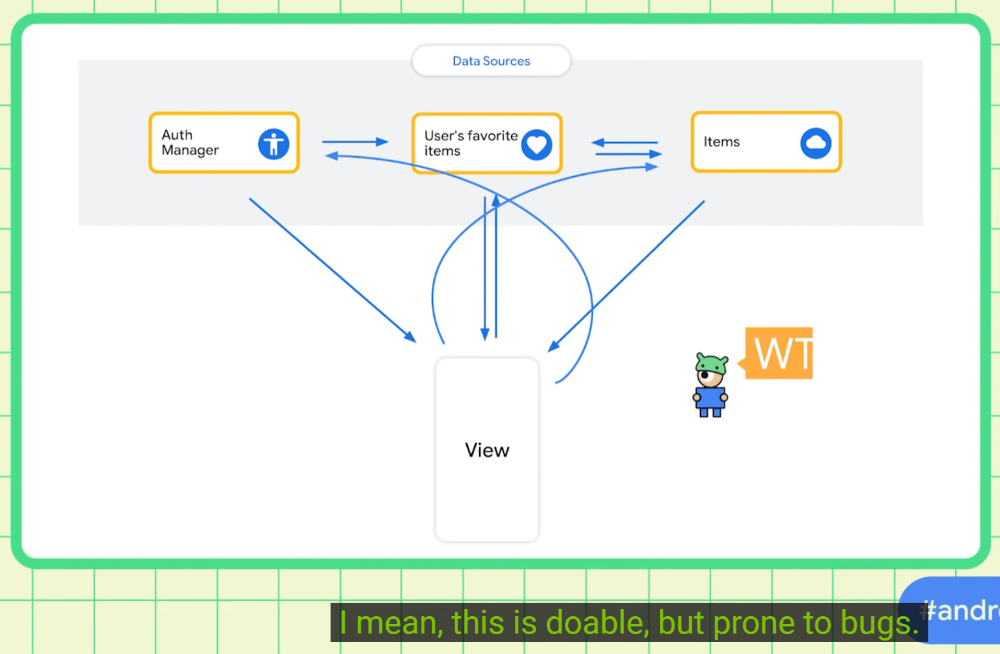
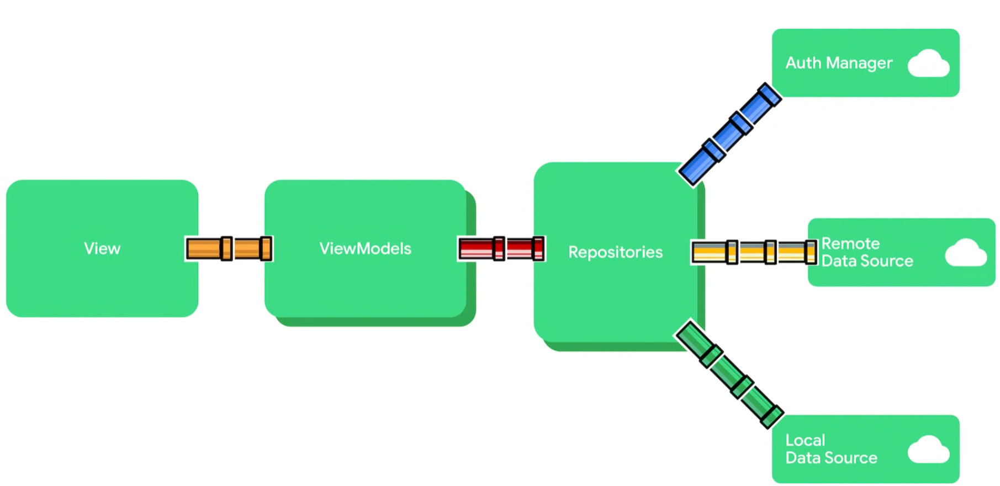
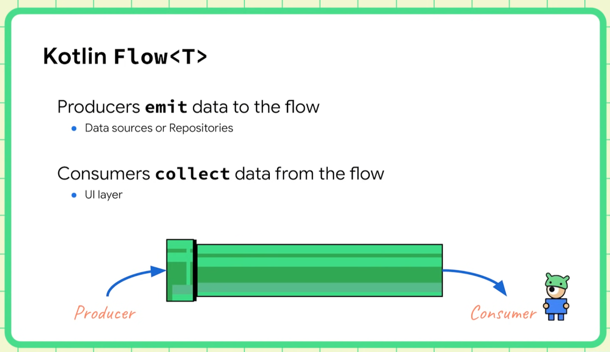

https://developer.android.com/kotlin/flow

A flow is a type that can emit multiple values sequentially, as opposed to suspend functions 
that return only a single value.









### Popular Android Libraries Providing Data in Kotlin Flow

Kotlin Flow has emerged as a cornerstone of modern Android development, enabling reactive 
programming through asynchronous data streams. Its integration with coroutines and seamless 
interoperability with Jetpack libraries has made it a preferred choice for handling real-time 
data updates, UI events, and network operations. Below is an exhaustive analysis of prominent 
Android libraries that leverage Flow to deliver data efficiently, ensuring type safety, 
backpressure handling, and lifecycle awareness.

#### 1. Room Database
Room, part of Android Jetpack, provides an abstraction layer over SQLite and natively supports 
Kotlin Flow for reactive database queries. When a DAO (Data Access Object) returns a `Flow>`, 
Room automatically emits updated results whenever the underlying data changes, eliminating 
manual refresh logic.    

```kotlin  
@Dao
interface UserDao {
 @Query("SELECT * FROM users")
 fun getUsers(): Flow<List<User>>
}
```
This emits a new list of `User` objects whenever the `users` table is modified, enabling 
real-time UI updates in ViewModels. Room’s integration with Flow ensures transactional 
consistency and efficient resource management, as it leverages coroutine scopes tied to 
lifecycle-aware components.    

#### 2. Jetpack DataStore
DataStore replaces SharedPreferences with a modern, Flow-based API for key-value pairs 
(Preferences DataStore) or typed objects (Proto DataStore). It guarantees asynchronous, 
transactional operations and automatic error handling.   

##### Preferences DataStore:
```kotlin  
val Context.dataStore: DataStore by preferencesDataStore(name = "settings")  
val theme_key = booleanPreferencesKey("dark_mode")  

val themeFlow: Flow = dataStore.data  
    .map { preferences -> preferences[theme_key] ?: false }  
```
DataStore emits the latest preference values on collection and caches them to minimize disk I/O.

##### Proto DataStore:
Proto DataStore uses Protocol Buffers to serialize custom objects, providing type safety:
```kotlin  
data class UserPreferences(val lastLogin: Long)  

val userPreferencesFlow: Flow = dataStore.data  
    .catch { exception ->  
        if (exception is IOException) emit(UserPreferences(0))  
        else throw exception  
    }  
```
This is ideal for complex configurations requiring structured data.

#### 3. Retrofit with Coroutines
Retrofit, a type-safe HTTP client, integrates with coroutines to return `Flow` from suspend 
functions. This enables reactive network request handling and seamless combination with database 
operations.   

```kotlin  
interface ApiService {
 @GET("users")
 suspend fun getUsers(): List<User>
}

fun fetchUsers(): Flow<List<User>> = flow {
 val users = apiService.getUsers()
 emit(users)
}.flowOn(Dispatchers.IO)
```
For pagination, Flow can be combined with the Paging Library to stream data incrementally.

#### 4. FlowBinding
FlowBinding converts Android UI events into Flow streams, replacing traditional listeners. It 
supports widgets like `View`, `RecyclerView`, and `ViewPager2`, providing backpressure-aware 
event streams.   

```kotlin  
button.clicks()  
    .onEach { /* Handle click */ }  
    .launchIn(lifecycleScope)  

viewPager2.pageSelections()  
    .onEach { position -> updateTab(position) }  
    .launchIn(viewLifecycleOwner.lifecycleScope)  
```
This library simplifies event-driven logic while ensuring automatic lifecycle management.

#### 5. WorkManager
WorkManager schedules background tasks and exposes work status via `Flow`. The `WorkInfo` stream 
includes states like `ENQUEUED`, `RUNNING`, and `SUCCESS`, enabling reactive UI updates.   

```kotlin  
val workInfoFlow: Flow =  
    WorkManager.getInstance(context).getWorkInfoByIdFlow(workRequest.id)  

workInfoFlow  
    .filter { it.state == WorkInfo.State.SUCCEEDED }  
    .onEach { /* Update UI */ }  
    .launchIn(viewModelScope)  
```

#### 6. Jetpack ViewModel and StateFlow
ViewModels expose UI state using `StateFlow`, a state-holder that emits the latest value to 
collectors. It ensures consistent state across configuration changes and integrates with Jetpack 
Compose.   

```kotlin  
class UserViewModel : ViewModel() {  
    private val _userState = MutableStateFlow(UserState.Loading)  
    val userState: StateFlow = _userState.asStateFlow()  

    fun loadUser() {  
        viewModelScope.launch {  
            _userState.value = UserState.Success(repository.fetchUser())  
        }  
    }  
}  
```

#### 7. Firebase Realtime Database and Firestore
Firebase’s Android SDKs offer Flow extensions for real-time data synchronization. The 
`firebase-firestore-ktx` library provides `snapshotFlow()` to listen for document changes:   

```kotlin  
firestore.collection("users")  
    .document("123")  
    .snapshotFlow()  
    .map { it.toObject(User::class.java) }  
    .onEach { user -> /* Update UI */ }  
    .launchIn(lifecycleScope)  
```

#### 8. Paging Library 3
The Paging Library delivers paginated data as `Flow`, enabling efficient loading of large 
datasets from network or database sources.  

```kotlin  
@Dao
interface UserDao {
 @Query("SELECT * FROM users")
 fun pagingSource(): PagingSource<Int, User>
}

val users: Flow<PagingData<User>> = Pager(config) {
 userDao.pagingSource()
}.flow
```

#### Conclusion
Kotlin Flow has become integral to Android’s ecosystem, with libraries like Room, DataStore, and 
Retrofit adopting it for real-time data handling. FlowBinding and StateFlow further bridge UI 
events and state management, while WorkManager and Paging Library extend its utility to 
background tasks and large datasets. By leveraging these libraries, developers can build 
responsive, maintainable applications that adhere to modern architectural patterns like MVVM and 
MVI. Future advancements may see deeper integration with Jetpack Compose and 
multi-platform projects, solidifying Flow’s role in Android development.       
