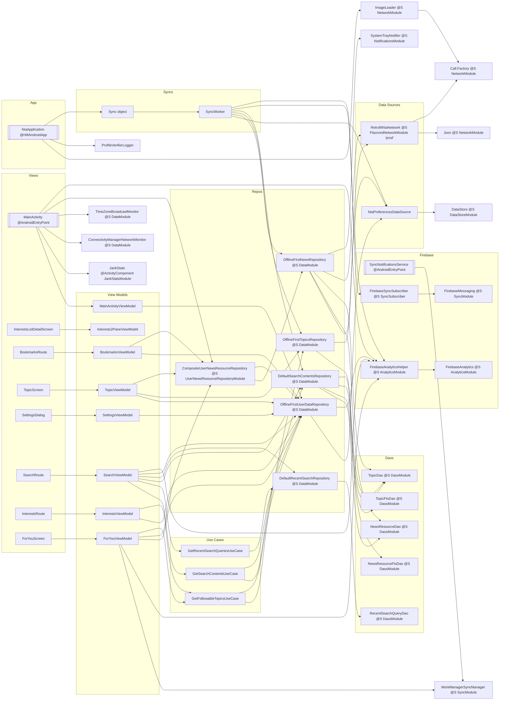

# Introduction

The [Now in Android](https://github.com/android/nowinandroid) project is an open-source Android
application designed to demonstrate best practices in modern Android development. It provides a
comprehensive example of modularization strategies and Gradle composite builds, along with
implementing the latest libraries and tools such as Jetpack Compose for building user interfaces,
dependency injection with Hilt, and asynchronous programming using Kotlin Coroutines and Flow.

I have been following and studying this demo project closely and have made some small
contributions to its development.

# My Contributions to the Public Repository of the Now in Android App

- https://github.com/android/nowinandroid/pull/1798

Before my PR, the unit test function
offlineFirstTopicsRepository_topics_stream_is_backed_by_topics_dao()
performs a comparison between two empty lists, topicDao.getTopicEntities().first().map(
TopicEntity::asExternalModel) and subject.getTopics().first(). This happens because
subject.syncWith(synchronizer) is not called beforehand.

As a result, the test is not meaningful, as it only compares two empty lists.

This PR improves the test by adding a subject.syncWith(synchronizer) call before retrieving the
topic entities. This ensures that the lists being compared contain actual elements, thereby proving
that offlineFirstTopicsRepository.getTopics() is backed by topicDao.getTopicEntities().

- https://github.com/android/nowinandroid/pull/1799

This PR adds a subject.syncWith(synchronizer) call before retrieving the lists, similar to PR #1798

# Dependency Graphs

Dependency Injection (`DI`) is used extensively in this project to manage and provide dependencies
efficiently. For different app build flavors, such as `prod` and `demo`, as well as for unit
testing, different implementations of interfaces across various levels of the architectural
hierarchy are injected.

The following diagrams, generated through prompt engineering and then manually edited, illustrate
which specific classes are injected for the `prod` and `demo` build flavors, as well as for unit
tests.

## Dependency Graph for the `prod` Build Flavor



## Dependency Graph for the `demo` Build Flavor

```mermaid
flowchart LR
subgraph "App"
NiaApplication[[@HiltAndroidApp]]
end

subgraph "Views"
MainActivity[[@AndroidEntryPoint]]
InterestsListDetailScreen
BookmarksRoute
TopicScreen
SettingsDialog
SearchRoute
InterestsRoute
ForYouScreen
end

subgraph "View Models"
MainActivityViewModel
BookmarksViewModel
ForYouViewModel
InterestsViewModel
SearchViewModel
SettingsViewModel
TopicViewModel
Interests2PaneViewModel
end

subgraph "Use Cases"
GetFollowableTopicsUseCase
GetRecentSearchQueriesUseCase
GetSearchContentsUseCase
end

subgraph "Repos"
CompositeUserNewsResourceRepository[CompositeUserNewsResourceRepository @S UserNewsResourceRepositoryModule]
DefaultRecentSearchRepository[DefaultRecentSearchRepository @S DataModule]
DefaultSearchContentsRepository[DefaultSearchContentsRepository @S DataModule]
OfflineFirstNewsRepository[OfflineFirstNewsRepository @S DataModule]
OfflineFirstTopicsRepository[OfflineFirstTopicsRepository @S DataModule]
OfflineFirstUserDataRepository[OfflineFirstUserDataRepository @S DataModule]
end

subgraph "Data Sources"
NiaPreferencesDataSource
DemoNiaNetworkDataSource[DemoNiaNetworkDataSource @S FlavoredNetworkModule 'demo']
end

subgraph "Daos"
TopicDao[TopicDao @S DaosModule]
TopicFtsDao[TopicFtsDao @S DaosModule]
NewsResourceDao[NewsResourceDao @S DaosModule]
NewsResourceFtsDao[NewsResourceFtsDao @S DaosModule]
RecentSearchQueryDao[RecentSearchQueryDao @S DaosModule]
end

subgraph "Syncs"
Sync[Sync object]
SyncWorker[SyncWorker]
end

StubAnalyticsHelper[StubAnalyticsHelper @S AnalyticsModule 'demo']
WorkManagerSyncManager[WorkManagerSyncManager @S SyncModule 'demo']
DataStore[DataStore @S DataStoreModule]
ImageLoader[ImageLoader @S NetworkModule]
Json[Json @S NetworkModule]
Call.Factory[Call.Factory @S NetworkModule]
TimeZoneBroadcastMonitor[TimeZoneBroadcastMonitor @S DataModule]
NoOpNotifier[NoOpNotifier @S NotificationsModule 'demo']
JankStats[JankStats @ActivityComponent JankStatsModule]
ConnectivityManagerNetworkMonitor[ConnectivityManagerNetworkMonitor @S DataModule]
JvmUnitTestDemoAssetManager[JvmUnitTestDemoAssetManager object]

%% App
NiaApplication --> ImageLoader
ImageLoader --> Call.Factory
NiaApplication --> ProfileVerifierLogger
NiaApplication --> Sync

%% Views
MainActivity --> MainActivityViewModel
MainActivity --> JankStats
MainActivity --> ConnectivityManagerNetworkMonitor
MainActivity --> TimeZoneBroadcastMonitor
MainActivity --> CompositeUserNewsResourceRepository
MainActivity --> StubAnalyticsHelper
InterestsListDetailScreen --> Interests2PaneViewModel
BookmarksRoute --> BookmarksViewModel
TopicScreen --> TopicViewModel
SettingsDialog --> SettingsViewModel
SearchRoute --> SearchViewModel
InterestsRoute --> InterestsViewModel
ForYouScreen --> ForYouViewModel

%% View Models
MainActivityViewModel --> OfflineFirstUserDataRepository
BookmarksViewModel --> OfflineFirstUserDataRepository
BookmarksViewModel --> CompositeUserNewsResourceRepository
ForYouViewModel --> WorkManagerSyncManager
ForYouViewModel --> StubAnalyticsHelper
ForYouViewModel --> OfflineFirstUserDataRepository
ForYouViewModel --> CompositeUserNewsResourceRepository
ForYouViewModel --> GetFollowableTopicsUseCase
InterestsViewModel --> OfflineFirstUserDataRepository
InterestsViewModel --> GetFollowableTopicsUseCase
SearchViewModel --> GetSearchContentsUseCase
SearchViewModel --> GetRecentSearchQueriesUseCase
SearchViewModel --> DefaultSearchContentsRepository
SearchViewModel --> DefaultRecentSearchRepository
SearchViewModel --> OfflineFirstUserDataRepository
SearchViewModel --> StubAnalyticsHelper
SettingsViewModel --> OfflineFirstUserDataRepository
TopicViewModel --> OfflineFirstUserDataRepository
TopicViewModel --> OfflineFirstTopicsRepository
TopicViewModel --> CompositeUserNewsResourceRepository

%% Use Cases
GetFollowableTopicsUseCase --> OfflineFirstTopicsRepository
GetFollowableTopicsUseCase --> OfflineFirstUserDataRepository
GetRecentSearchQueriesUseCase --> DefaultRecentSearchRepository
GetSearchContentsUseCase --> DefaultSearchContentsRepository
GetSearchContentsUseCase --> OfflineFirstUserDataRepository

%% Repos
CompositeUserNewsResourceRepository --> OfflineFirstNewsRepository
CompositeUserNewsResourceRepository --> OfflineFirstUserDataRepository
DefaultRecentSearchRepository --> RecentSearchQueryDao
DefaultSearchContentsRepository --> NewsResourceDao
DefaultSearchContentsRepository --> NewsResourceFtsDao
DefaultSearchContentsRepository --> TopicDao
DefaultSearchContentsRepository --> TopicFtsDao
OfflineFirstNewsRepository --> NiaPreferencesDataSource
OfflineFirstNewsRepository --> NewsResourceDao
OfflineFirstNewsRepository --> TopicDao
OfflineFirstNewsRepository --> DemoNiaNetworkDataSource
OfflineFirstNewsRepository --> NoOpNotifier
OfflineFirstTopicsRepository --> TopicDao
OfflineFirstTopicsRepository --> DemoNiaNetworkDataSource
OfflineFirstUserDataRepository --> NiaPreferencesDataSource
OfflineFirstUserDataRepository --> StubAnalyticsHelper
NiaPreferencesDataSource --> DataStore
DemoNiaNetworkDataSource --> Json
DemoNiaNetworkDataSource --> JvmUnitTestDemoAssetManager

%% Sync
Sync --> SyncWorker
SyncWorker --> NiaPreferencesDataSource
SyncWorker --> OfflineFirstTopicsRepository
SyncWorker --> OfflineFirstNewsRepository
SyncWorker --> DefaultSearchContentsRepository
SyncWorker --> NoOpAnalyticsHelper
SyncWorker --> StubSyncSubscriber
```

## Dependency Graph for Unit Tests

- [ ] TODO: To be added
